<!-- 
cSpell:words Präsenzmelder Präsenzkanäle Präsenzerkennung Präsenzinformationen Präsenzsensor Präsenzkanälen Präsenzsignal Präsenzinformation Präsenzeingänge präsenzerfassende Präsenzeinstellungen Präsenzsignals präsenzabhängig Präsenzmodul Präsenzmoduls Praesenz
cSpell:words Helligkeitsgesteuert Helligkeitsunabhängig helligkeitsbasierte Luxwert helligkeitsbezogenen Helligkeitsabhängig helligkeitsverändernden
cSpell:words Szenennutzung Szenensteuerung szenensteuerung
cSpell:words Dimmwert Dimmadressen Dimmstatus Dimmaktor Dimmvorgänge Aktorstatus Aktorstatuswechsel Detektions
cSpell:words Moduswechsel Manuellmodus Tagesphasenabhängig Kommunikaitonsobjekte Melderkanal priorität erwartungskonform VEML Eingaenge
-->

# Applikationsbeschreibung Präsenz

Die Applikation Präsenz erlaubt eine Parametrisierung von Kanälen mit Präsenzmelder-Funktionalität mit der ETS.

Sie ist in die Bereiche

* Allgemeine Parameter
* PM-Kanäle
* Logikkanäle

gegliedert, wobei die Präsenzkanäle wiederum in bis zu 40 Kanäle untergliedert sind.

Alle Logikkanäle sind in der [Applikation Logik](https://github.com/OpenKNX/OAM-LogicModule/blob/v1/doc/Applikationsbeschreibung-Logik.md) beschrieben.

## Inhalte
> Achtung: Nachfolgende Auflistung teilweise abweichend von Reihenfolge im Dokument
* [Änderungshistorie](#änderungshistorie)
* [Präsenzmelder als Applikation](#präsenzmelder-als-applikation)
* [Präsenzmelder als Modul](#präsenzmelder-als-modul))
  * [Tagesphasen](#tagesphasen)
  * [Adaptive Ausschaltschwelle über Helligkeit](#adaptive-ausschaltschwelle-%C3%BCber-helligkeit)
  * [Automatik-, Manuell- und Sperrmodus](#automatik--manuell--und-sperrmodus)
* [Grundsätzliche Funktion eines Präsenzkanals](#grundsätzliche-funktion-eines-präsenzkanals)
  * [Interne Modi](#interne-modi)
    <!-- * [Normalmodus](#normalmodus)
    * [Automodus](#automodus)
    * [Manuellmodus](#manuellmodus-1) -->
* [HF-Sensor Konfiguration](#hf-sensor-konfiguration)
* [ETS Konfiguration](#ets-konfiguration) (Übersicht aller Konfigurationsseiten und Links zu Detailbeschreibung)
  * [Kommunikationsobjekte](#kommunikationsobjekte)
* [Wichtige Anmerkungen](#wichtige-anmerkungen)
  * [externer Präsenz- und Bewegungseingang, kein Bewegungssignal und Kurzzeitpräsenz](#externer-pr%C3%A4senz--und-bewegungseingang-kein-bewegungssignal-und-kurzzeitpr%C3%A4senz)
* [Beispiele](#beispiele) (noch leer)
  <!-- * [Update der Applikation](#update-der-applikation) -->
* [Unterstützte Hardware](#unterstützte-hardware)
* Fortgeschrittene Funktionen
  * [Diagnoseobjekt](#diagnoseobjekt)

### ETS Konfiguration

* **+ [ Allgemeine Parameter](#allgemeine-parameter)**
  * [Gerätestart](#gerätestart)
  <!-- * [Installierte Hardware](#installierte-hardware) -->
  * [**Experteneinstellungen**](#experteneinstellungen)
* [**+ PM-Kanäle**](#pm-kan%C3%A4le)
  * [**PM-Hardware**](#pm-hardware)
    * [Einstellungen Präsenz-Hardware](#einstellungen-pr%C3%A4senz-hardware)
    * [Helligkeit](#helligkeit)
    * [LED](#led)
  * [**+ PM n: unbekannt**](#pmx-unbekannt)
    * [Kanaldefinitionen](#kanaldefinition)
    * [Helligkeit](#helligkeit-1)
    * [Präsenzeingänge](#präsenz--und-bewegungseingänge)
    * [Ausgänge](#ausgänge)
    * [Sperre](#sperre)
    * [Tagesphasen](#tagesphasen-1)
      * [Spezialfall Tag-/Nacht-Objekt](#spezialfall-tag-nacht-objekt)
    * [Raum verlassen](#raum-verlassen) (Experimentelle Sonderfunktion!)
    * [Manuell übersteuern](#manuell-übersteuern)
    * [**Eingänge**](#eingänge) <!-- TODO Reihenfolge in App und Dokument -->
    * [**Szenensteuerung**](#szenensteuerung) <!-- TODO Reihenfolge in App und Dokument -->
    * [**Phase 1-4: Tag/Nacht/Morgen/Abend/...**](#phase-n-phasenname)
      * [Funktion](#funktion)
      * [Helligkeit](#helligkeit-2)
        * [adaptive Schwelle](#adaptive-schwelle)
      * [Präsenzeinstellungen](#präsenzeinstellungen)
      * [Ausgang 1/2](#ausgang-12)
      * [Manuelle Bedienung](#manuelle-bedienung)
* **+ Logikkanäle** (siehe [Dokumentation zum Logikmodul](https://github.com/OpenKNX/OAM-LogicModule/blob/v1/doc/Applikationsbeschreibung-Logik.md))

## Änderungshistorie

Im folgenden werden Änderungen an dem Dokument erfasst, damit man nicht immer das Gesamtdokument lesen muss, um Neuerungen zu erfahren.

07.12.2024: Firmware 3.6, Applikation 3.6

* FIX: Fix für das Logikmodul mit Auswirkungen auf das Präsenzmodul (Das neue Sendeverhalten am Ausgang und der Wiederholungsfilter haben sich leider gegenseitig beeinflusst und zu unerwarteten Ergebnissen geführt, die Logiken kaputt machen konnten. Deswegen ein Hotfix)

* Die enthaltene Logik hat jetzt die Version 3.4

01.12.2024: Firmware 3.5, Applikation 3.5

* NEU: Für den HLK2420 wurde statt der Kalibrierung eine komplett neue Einstellungsseite entwickelt
* NEU: Diagnose für den HLK2420 berücksichtigt die neuen Einstellungsmöglichkeiten
* FIX: Der RealPresence hat bei 2 Usern nicht funktioniert, weil sie eine andere Hardware-Variante hatten, dies ist jetzt korrigiert.
* FIX: Wenn nur PIR aktiviert war, wurde dessen Stromversorgung nicht eingeschaltet.
* NEU: Große Doku-Erweiterung für die Einstellungsmöglichkeiten vom HLK-Sensor [HF-Sensor Konfiguration](#hf-sensor-konfiguration) (diese wird weiterhin in den nächsten Tagen erweitert)
* NEU: Alle Firmware-Varianten haben ein neues Script zum KNX-Firmware-Update bekommen, das einen Upload über den KNX-Bus erlaubt.

* Die enthaltene Logik hat jetzt die Version 3.4
* Der enthaltene Konfigurations-Transfer hat jetzt die Version 0.2
* Das enthaltene Taster-Modul hat jetzt die Version 0.5

22.07.2024: Firmware 3.2, Applikation 3.2.1

* FIX: Wenn mit ConfigTransfer die VPM-Basiskonfiguration von einer älteren VPM-Version auf die aktuelle übertragen wurde, konnte das interne KO-Referenzen auf falsche KO zeigen lassen.
* FIX: Der PIR-Sensor hat beim Neustart fälschlicherweise Präsenz-Signale ausgegeben
* NEU: Kalibrierung für den HLK-Sensor wurde komplett neu entwickelt
* NEU: Diagnose für den HKL-Sensor ist komplett neu implementiert
* FIX: Empfindlichkeitskurve für den PIR-Sensor wurden leicht angepasst

18.07.2024: Firmware 3.1, Applikation 3.1

* NEU: Der Präsenzmelder enthält jetzt auch 30 virtuelle Taster (auf Benutzerwunsch)

12.07.2024: Firmware 3.0, Applikation 3.0

>**Wichtig**: Die Version 3.0 der Firmware ist nur für PresenceModule-Big und PresenceModule-IP verfügbar. Für PresenceModule-Release wird es eine Migrationsunterstützung auf die PresenceModule-Big geben, sofern man RP2040-basierte Hardware verwendet.
Das PresenceModule-Release für SAMD-basierte Hardware wird in Zukunft nicht mehr weiterentwickelt. Der SAMD ist am Ende seiner Kapazität angelangt und kann die neuen Funktionalitäten der aktuellen Firmware nicht mehr prozessieren.

* Auf die Version 3.0 kann nur von der Version 2.15 aus aktualisiert werden.
* NEU: Eine neue Applikation PresenceModule-IP ist verfügbar für einen VPM als reines KNX-IP-Gerät
* NEU: Kontextsensitive Hilfe ist jetzt in der ETS-Applikation verfügbar
* NEU: Konfigurationstransfer ist jetzt Teil der ETS-Applikation
* NEU: Einheitliches UI-Design der OpenKNX-Produkte
* FIX: Beim Startup wurden möglicherweise zu viele ReadRequests gesendet (auch für KO, die bereits initialisiert waren)
* NEU: Als Präsenz-Hardware wird auch der HF-Sensor HLKLD2420 unterstützt (Beta)
* NEU: Als Präsenz-Hardware wird auch ein PIR-Sensor unterstützt (nur für Bewegungsmodus)

* Die enthaltene Logik ist jetzt Version 3.3

12.07.2024: Firmware 2.15, keine Applikation

* Man muss in der ETS auf diese Version aktualisieren, bevor man auf die Version 3.0 aktualisieren kann.

12.12.2023: Firmware 2.0, Applikation 2.0 (nur intern)

* NEU: Die Firmware kann jetzt über den KNX-Bus aktualisiert werden (nur bei RP2040-Prozessor aka Raspberry Pi Pico)
* Die enthaltene Logik hat den Firmware-Stand 2.0

05.09.2023: Firmware 1.11.3, Applikation 1.11 

* FIX: Tagesphasenwechsel wertet jetzt erneut Präsenz aus, da sonst bei einem Wechsel von einer Tagesphase, die nicht selbst einschaltet in eine Phase, die selbst einschaltet nicht eingeschaltet worden ist.
* FIX: Man kann beim Ausschalten über Helligkeit als Ausschaltschwelle jetzt auch 0 Lux angeben und es wird bei 0 Lux ausgeschaltet. Bisher musste die Helligkeit > als die Ausschaltschwelle, also größer als 0 sein.
* FIX: Der KNX-Stack ist jetzt wesentlich robuster bei hoch ausgelastetem KNX-Bus. Das hat direkte Auswirkungen auf die Logik, die früher bei Hochlast Telegramme ausgelassen wurden, die dann als Trigger für Logiken fehlten.
* FIX: Einige wenige DPT9-Werte ungleich 0 wurden vom KNX-Stack als 0 gesendet. Das ist gelöst. Es waren Werte der Form &pm;(2n)/100 für n>10, also z.B. &pm;20.48, &pm;40.96, &pm;81.92, &pm;163.84, &pm;327.68, &pm;655.36 usw. 
* Dieses Release profitiert primär von den Stabilitätsverbesserungen des KNX-Stack 

18.02.2023: Firmware 1.7.6, Applikation 1.7

* Die enthaltene Logik hat den Firmware-Stand 1.4.2
* Startup-Verhalten der PM-Hardware leicht geändert, der HF-Sensor wird erst nach 15 Sekunden gestartet.

10.01.2023: Firmware 1.7.1, Applikation 1.7

* Die enthaltene Logik hat den Firmware-Stand 1.4.1

28.12.2022: Firmware 1.6, Applikation 1.6

* Die enthaltene Logik hat den Firmware-Stand 1.1

23.12.2022: Firmware 1.5.3, Applikation 1.5

* Die enthaltene Logik hat den Firmware-Stand 1.0.3 und ermöglicht damit das Speichern der Logikeingänge im nichtflüchtigen Speicher.

09.12.2022: Firmware 1.4.4, Applikation 1.4 (nicht released)

* FIX: Option "gesperrt (0) / nicht gesperrt (1)" bei Sperreinstellungen wurde nicht ausgewertet.
* FIX: Option "Zeit bis das Gerät nach einem Neustart aktiv wird" wurde mit einer falschen Zeitbasis ausgeführt (Millisekunden statt Sekunden)

06.12.2022: Firmware 1.4.1, Applikation 1.4 (nicht released)

* FIX: Der Schalter "Automatik übersteuern = AUS heißt Raum verlassen" wurde nicht ausgewertet. Sobald "Raum verlassen" konfiguriert ist, wurde es immer genutzt. Das ist jetzt korrigiert.
* FIX: Die Diagnose für "Raum verlassen" gab nicht den Modus aus, der eingestellt war.

27.11.2022: Firmware 1.4, Applikation 1.4 (nicht released)

* FIX: Rückfallzeit für Sperre funktionierte nicht, ist jetzt korrigiert.
* NEU: Tagesphasen kann man jetzt auch über die Szenensteuerung wechseln, Neuerungen hierzu sind im Kapitel [Szenensteuerung](#szenensteuerung) beschrieben.
* NEU: Über die Szenensteuerung kann man jetzt auch den Manuellmodus aktivieren und deaktivieren (wie bei Eintastensteuerung). Siehe dazu Kapitel [Szenensteuerung](#szenensteuerung) 
* NEU: Über die Szenensteuerung kann man jetzt alle Sperrmodi (unabhängig von der Konfiguration der Sperre) setzen und zurücksetzen. Siehe dazu Kapitel [Szenensteuerung](#szenensteuerung) 
* FIX: Sperre hat jetzt auch ein Ü-Flag

20.11.2022: Firmware 1.3.1, Applikation 1.3

* FIX: Helligkeitsschwellen (zum Ein- und Ausschalten) und Nachlaufzeit werden beim Startup erst nach der Startverzögerung des Kanals gesendet 
* NEU: Status Manuell und Status Sperre werden jetzt auch beim Startup (nach der Startverzögerung) des Kanals gesendet
* FIX: Ein Aktorstatus EIN während der Totzeit von "Raum verlassen" konnte dazu führen, dass der Melder intern EIN blieb, obwohl der Ausgang AUS war. Symptom: Licht wurde nicht mehr automatisch eingeschaltet.
* FIX: Ein AUS an einem schaltenden Präsenz- oder Bewegungseingang konnte dazu führen, dass die Nachlaufzeit erneut gestartet wurde.  
* FIX: ETS-Applikation hat "Raum Verlassen" nicht immer angezeigt.
* NEU: Kapitel [Wichtige Anmerkungen](#wichtige-anmerkungen), das Erkenntnisse aus Tests und User Feedback beschreibt, um andere User vor Fehlern zu bewahren.
* NEU: Weitere Hardware verfügbar ([Siehe unterstützte Hardware](#unterstützte-hardware))
* Die enthaltene Logik hat den Firmware-Stand 0.13

05.11.2022: Firmware 1.1.3, Applikation 1.1

* NEU: Wenn ein externer PM zurückgesetzt werden kann, kann man jetzt wählen, ob dieser mit einem EIN- oder einem AUS-Signal zurückgesetzt wird
* NEU: Ein externer Präsenz- oder Bewegungseingang kann jetzt auch dazu genutzt werden, den aktuellen Präsenzzustand zu verlängern, aber nicht, um Präsenz einzuschalten.
* Die enthaltene Logik hat den Firmware-Stand 0.12.3

20.10.2022: Firmware 1.0, Applikation 1.0

* Initiales Release

## Präsenzmelder als eigene Applikation

Der Präsenzmelder hat auch eine eigene ETS-Applikation, die es erlaubt, das Präsenzmelder-Modul ohne Einbettung in eine andere Applikation zu verwenden. In diesem Fall hat es zusätzliche Untermodule, einige davon sind standardmäßig in OpenKNX-Applikationen verfügbar: 

### **OpenKNX**

Dies ist eine Seite mit allgemeinen Parametern, die unter [Applikationsbeschreibung-Common](https://github.com/OpenKNX/OGM-Common/blob/v1/doc/Applikationsbeschreibung-Common.md) beschrieben sind. 

### **Konfigurationstransfer**

Der Konfigurationstransfer erlaubt einen

* Export von Konfigurationen von OpenKNX-Modulen und deren Kanälen
* Import von Konfigurationen von OpenKNX-Modulen und deren Kanälen
* Kopieren der Konfiguration von einem OpenKNX-Modulkanal auf einen anderen
* Zurücksetzen der Konfiguration eines OpenKNX-Modulkanals auf Standardwerte

Die Funktionen vom Konfigurationstransfer-Modul sind unter [Applikationsbeschreibung-ConfigTransfer](https://github.com/OpenKNX/OFM-ConfigTransfer/blob/v1/doc/Applikationsbeschreibung-ConfigTransfer.md) beschrieben.

### **Virtuelle Taster**

Die Präsenzmelder-Applikation enthält auch virtuelle Taster.

Die Funktionen des VirtualButton-Moduls sind unter [Applikationsbeschreibung-Taster](https://github.com/OpenKNX/OFM-VirtualButton/blob/v1/doc/Applikationsbeschreibung-Taster.md) beschrieben.

### **Logiken**

Wie die meisten OpenKNX-Applikationen enthält auch die Präsenzmelder-Applikation ein Logikmodul.

Die Funktionen des Logikmoduls sind unter [Applikationsbeschreibung-Logik](https://github.com/OpenKNX/OFM-LogicModule/blob/v1/doc/Applikationsbeschreibung-Logik.md) beschrieben.

## Präsenzmelder als Modul

Dieses Modul realisiert alle wesentlichen Funktionen eines Präsenz- bzw. Bewegungsmelders. Es kann als Teil anderer Applikationen fungieren, natürlich auch als Teil der eigenen Präsenzmelder-Applikation.

Es kann mit passender Präsenz- oder Bewegungsmelder-Hardware betrieben werden oder - und das ist das Besondere - auch als "Virtueller Präsenzmelder", indem es Präsenz-, Bewegungs- und Helligkeitsinformationen über den KNX-Bus empfängt. Somit kann dieses Module eine Art Update für existierende Präsenzmelder-Hardware darstellen, deren Applikation alt oder ungenügend ist und die gewünschten Funktionen nicht leistet. Oder als Ersatz-PM-Applikation für konventionelle Melder, die über einen Binäreingang im KNX-System integriert sind.

Auch wenn im Folgenden immer von Präsenzmelder gesprochen wird, so hängt diese Eigenschaft von der verwendeten Präsenz- bzw. Bewegungserkennung ab. Somit ist aus Sicht des Moduls Präsenz- und Bewegungsmelder synonym zu sehen, die angeschlossene Hardware bestimmt durch ihre Sensitivität, ob es sich um einen Präsenz- oder Bewegungsmelder handelt.

Die Idee zu diesem Modul ist bei der Verwendung vom True Presence Präsenzmelder entstanden. Dieser hat eine gute bis sehr gute Präsenzerkennung, einen mittelmäßigen Helligkeitssensor und eine schlechte Applikation. In Verbindung mit diesem (virtuellen) Präsenzmelder-Modul funktioniert er wesentlich besser und kann dann sogar zusätzliche Funktionen wie Kurzzeit-Präsenz.

<!-- DOC HelpContext="Dokumentation" -->

<!-- DOCCONTENT
Eine vollständige Applikationsbeschreibung ist unter folgendem Link verfügbar: https://github.com/OpenKNX/OFM-PresenceModule/blob/v1/doc/Applikationbeschreibung-Praesenz.md

Weitere Produktinformationen sind in unserem Wiki verfügbar: https://github.com/OpenKNX/OpenKNX/wiki/Produktinfo-Pr%C3%A4senzmodul
DOCCONTENT -->

Dieses Präsenzmelder-Modul implementiert folgende Funktionen:

* "Klassischer Präsenzmelder" mit
  * schalten bei Bewegung
  * ausschalten nach einer gewissen Nachlaufzeit
  * Helligkeitsgesteuert oder Helligkeitsunabhängig
  * 2 Ausgängen pro Kanal mit unterschiedlichen DPT
  * Durchgangsraum, einschalten erst nach einiger Zeit

* Virtueller PM: Verwendbar mit einem oder mehreren Slaves
  * PM ist dann Master für alle Slaves
  * Das Präsenz-Signal kann schaltend oder triggernd sein
  * Helligkeit kann vom gleichen Slave kommen oder von irgendeinem anderen Helligkeitssensor
  * Falls die externe Quelle getrennt Bewegungs- und Präsenzinformationen liefern kann, wird das in dafür geeigneten Funktionen berücksichtigt.

* Tagesphasen
  * Es wird nicht nur Tag/Nacht, sondern bis zu 4 Tagesphasen unterstützt (Morgens, Tag, Abend, Nacht)
  * Tagesphasen können beliebig benannt werden
  * Jede Tagesphase unterstützt eigene Nachlaufzeiten, Helligkeiten, Kurzzeitpräsenz
  * Falls mehr als 4 Tagesphasen benötigt werden, kann man das durch zusammenschalten von Kanälen erreichen

* Innovative Adaptive Ausschaltschwelle über Helligkeit
  * Erlaubt absolute oder relative Helligkeitsschwellen
  * Abschaltung bei externen Lichteinflüssen
  * Beachtet mehrere Lichtkanäle pro Raum

* Automatik- und Manuell- und Sperrmodus
  * Der Moduswechsel ist über Ein- und Zweitastenbedienung vorgesehen
  * Der Moduswechsel kann auch über Szenen vorgenommen werden
  * Einstellbare Rückfallzeiten für Manuell- oder Sperrmodus

* Innovative "Raum verlassen"-Funktion
  * Erlaubt dem Melder die Unterscheidung zwischen "Licht aus und im Raum bleiben" und "Licht aus und Raum verlassen".
  * Schaltet damit Licht genau dann erneut ein, wenn man es benötigt

* Viele Parameter über GA modifizierbar
  * aktuelle Helligkeitsschwelle
  * aktuelle Nachlaufzeit
  * aktuelle Tagesphase
  * Sensibilität des HF-Sensors
  * Szenario für HF-Sensor
  * Sensibilität des PIR-Sensors

* Erweiterte Steuerungsmöglichkeiten
  * alle Melderfunktionen sind über Szenen steuerbar
  * Jeder Eingang kann bei Busspannungswiederkehr Werte lesen
  * KO können auch intern verknüpft werden (Interne KO) und so die Buslast vermindern

### Tagesphasen

Jeder PM-Kanal unterstützt bis zu 4 Tagesphasen, die frei benannt werden können und unterschiedliches Ein- und Ausschaltverhalten erlauben. Benötigt man nur 2 Phasen, kann man diese auch als Tag-/Nachtphase nutzen.

Mehr als 2 Phasen eignen sich z.B. für

* Morgens: Sehr helles Licht (zum aufwachen und frühstücken)
* Tag: Kurze Nachlaufzeit, also schnelles abschalten nach manuellem einschalten
* Abends: Über Szene mehrere Lichtkreise einschalten, alle Lichtkreise abschalten
* Nachts: Nur stark gedimmtes Licht für die Orientierung, kurze Nachlaufzeit

Der Phantasie sind hier keine Grenzen gesetzt. Die Phasen können auch ganz anders heißen, z.B. Normal, Fernsehen, Lesen und Nacht. Mit dem integrierten Logikmodul können die Phasen passend über Zeitschaltuhren oder entsprechende Logikfunktionen aktiviert werden.

### Adaptive Ausschaltschwelle über Helligkeit

Die Hauptanwendung für einen Präsenzmelder ist immer noch das Schalten von Licht. Während sich die meisten Personen, die neu im Bereich Hausautomatisierung sind, Gedanken darüber machen, wann das Licht eingeschaltet werden soll und wann nicht, ist die größte Herausforderung, wann das Licht ausgeschaltet werden soll. Die erste (laienhafte) Idee hierzu ist: "Wenn ich nicht im Raum bin", allerdings ist das zu kurz gedacht.

Die Information "Wenn ich nicht im Raum bin" hängt von der Qualität der Präsenzerkennung ab und es gibt viele Stellschrauben wie Nachlaufzeit, Empfindlichkeit, Kurzzeitpräsenz, die eine individuelle und zufriedenstellende Einstellung hierzu erlauben, auch bei diesem Präsenzmelder.

Dem 2. Aspekt für das Ausschalten des Lichts - "Wenn es wieder hell genug ist" - wird hingegen bei derzeit verfügbaren Produkten am Markt sehr wenig Aufmerksamkeit geschenkt. Die Situation ist einfach zu motivieren:

Man kommt morgens ins Esszimmer zum Frühstück, es dämmert draußen, das Licht wird vom PM eingeschaltet, da es noch nicht hell genug ist. Während des Frühstücks wird es heller und die Helligkeit von außen wird so hoch, dass sie das Licht im Raum überflüssig macht. Jetzt sollte der PM das Licht ausschalten.

Es gibt Präsenzmelder, die eine helligkeitsbasierte Ausschaltschwelle erlauben. Leider ist diese häufig statisch und unflexibel. Hat man mehrere Lichtkreise im Raum, kann diese statisch eingestellte Helligkeitsschwelle nicht unterscheiden, ob es heller geworden ist, indem jemand einen weiteren Lichtkreis eingeschaltet hat oder weil die Sonne jetzt stärker scheint. Im ersten Fall will man das Licht natürlich nicht ausschalten, im letzteren schon.

Die in diesem Melder eingebaute adaptive Ausschaltschwelle berücksichtigt genau dieses Problem und erlaubt eine smarte Abschaltung des Lichts unter Berücksichtigung beliebig vieler Lichtkreise und verschiedener Möglichkeiten der Helligkeitsänderung mittels schalten, dimmen und Szenennutzung.

Die Grundidee ist einfach: Nach dem Einschalten von einem oder mehreren Lichtkreisen wird einen Moment gewartet, bis der Lichtsensor die aktuelle Helligkeit im Raum gemessen hat und dem PM gemeldet hat. Jetzt wird die Ausschaltschwelle berechnet: Der Benutzer hat in der Applikation festgelegt "Um wie viel heller darf es werden?". Dieser Wert wird zur aktuellen Helligkeit addiert und das als neue Ausschaltschwelle festgelegt. Darf es um 20 Lux heller werden und es wurden 127 Lux gemessen, so ist die Ausschaltschwelle 147 Lux.

Erhöht sich die Helligkeit im Raum durch das Sonnenlicht auf 150 Lux, würde das Licht ausgeschaltet werden, da es jetzt heller ist als durch die Beleuchtung im Raum.

Erhöht sich die Helligkeit im Raum durch eine Szene (die eine weitere Lichtquelle auf 50% dimmt) auf 150 Lux, würde der PM eine neue Ausschaltschwelle berechnen (150 Lux + 20 Lux = 170 Lux). Das passiert dadurch, dass der PM auf alle Schalt-, Dimm- und Szenen-Signale aller Lichtquellen im Raum hörend reagiert. Die neue Schwelle würde somit eine Lichtabschaltung durch weitere Lichtquellen verhindern. Würde das Sonnenlicht jetzt die Raumhelligkeit auf 171 Lux bringen, würde auch hier wieder das Licht ausgeschaltet werden.

Da man nicht mit jeder Wolke, die vorüber zieht, sein aktuelles Lichtambiente ausgeschaltet bekommen will, kann man auch eine Nachlaufzeit einstellen, in der die Ausschaltschwelle überschritten werden darf, bevor das Licht ausgeschaltet wird. Ist diese Nachlaufzeit z.B. 5 Minuten, muss im obigen Beispiel die Helligkeit von 170 Lux 5 Minuten lang überschritten sein, bevor das Licht ausgeschaltet wird.

Die Einstellungen für die adaptive Ausschaltschwelle sind Tagesphasenabhängig und können somit in den Morgenstunden anders definiert werden als in den Tages- oder Abendstunden.

### **Automatik-, Manuell- und Sperrmodus**

Egal wie gut ein PM ist und wie aufwändig alles parametriert ist, aktuelle Wünsche des Benutzers werden immer dem Melder mitgeteilt werden müssen.

Dies versetzt dann den Melder in einen bestimmten Sondermodus, der den aktuellen Benutzerwunsch repräsentiert.

#### **Sperrmodus**

Wie jeder andere Präsenzmelder kann auch dieser PM gesperrt werden. Eine Sperre ist eine Funktion mit sehr hoher Priorität, die alle anderen Funktionen des PM deaktiviert. Es werden somit jegliche Präsenz- oder Helligkeitsinformationen wie auch niedriger priorisierte Benutzeraktionen ignoriert.

Eine Sperre kann nur durch einen Entsperrbefehl oder automatisch nach der eingestellten Rückfallzeit aufgehoben werden.

#### **Manuellmodus**

Der Manuellmodus ist ähnlich dem Sperrmodus, allerdings mit geringerer Priorität und flexibler. 

#### **Automatikmodus**

Folgende Situation: Man sitzt abends zusammen und möchte bei Kerzenschein gemütlich einen Wein trinken. Da es dunkel ist, hat der Melder die Beleuchtung bereits eingeschaltet, man möchte also das Licht ausschalten, um die Kerzen zur Geltung kommen zu lassen.

Andere Situation: Man kommt morgens zum Frühstück. Es ist noch dämmerig, aber schon so hell, dass der Melder das Licht nicht angemacht hat. Subjektiv ist es aber zu dunkel und man möchte das Licht einschalten, damit man gemütlich frühstücken kann.

Klassische Melder bieten für so etwas Sperren an, die den Melder deaktivieren. Damit kann natürlich die gewünschte Lichtsituation (abends manuell ausschalten, morgens manuell einschalten) erreicht werden.

Eine Sperre ist aber in einer solchen Situation meist ein viel zu grobes Werkzeug und hat einige Nachteile:

* Es muss zuerst die Sperre aktiviert werden
* dann muss der gewünschte Lichtzustand eingestellt werden
* Der Melder verliert durch die Sperre jegliche Funktionalität
* Man muss explizit dran denken, dass man beim Verlassen des Raumes noch eine aktive Sperre hat und diese deaktivieren
* und nach den deaktivieren der Sperre muss man auch noch das Licht ausmachen.

## **Präsenzmelder**

Unter diesem Tab sind alle Einstellungen für den Präsenzmelder zusammengefasst. Jeder der folgenden Tabs wird in einem eigenen Kapitel beschrieben.

<!-- DOC HelpContext="PM-Hardware" -->
### **Allgemein**

Da diese Applikation auch als virtueller Präsenzmelder fungieren kann, ist keine Präsenz-Hardware notwendig. Falls aber Präsenz-Hardware vorhanden ist, können auf dieser Seite deren Grundfunktionen parametriert werden. Diese Hardware kann dann bei den einzelnen PM-Kanälen weiterhin genutzt werden.

### Präsenz-Hardware

<kbd>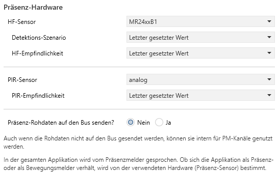</kbd>

<!-- DOC -->
#### **HF-Sensor**

<!-- Das ist ein Kommentar -->

Der vorhandene Hochfrequenz-Sensor kann hier ausgewählt werden. Derzeit werden entweder der HF-Sensor MR24xxB1 oder der HLK-LD2420 unterstützt. Wird der HLK-LD2420 gewählt, dann werden die Einstellungen für diesen Sensor auf einer Eigenen Seite ["HF-Sensor"](#einstellungen-hf-sensor) vorgenommen.

#### **Detektions-Szenario**

Erscheint nur, wenn als Hardware-Präsenzsensor der HF-Sensor MR24xxB1 ausgewählt worden ist.

<!-- DOC HelpContext="Detektions-Szenario" -->
Hier kann man das vom Hersteller des HF-Sensors vorgesehene Szenario für die Detektion von Präsenz auswählen, das nach einem Neustart zur Verfügung steht. Die aufgeführten Werte sind dem technischen Dokument entnommen, inclusive der angenommenen Montage. Inwiefern das zum realen Einsatzort passt, können wir derzeit nicht beurteilen. Aktuelle Empfehlung ist, die Werte durchzuprobieren, bis man ein für sich passendes Erfassungsszenario gefunden hat. 

<!-- DOC Skip="2" -->
<kbd></kbd>

Der Wert "Letzter gesetzter Wert" nimmt bei einem Neustart den Wert für Szenario, der vor dem Neustart gesetzt war.
<!-- DOCEND -->

Der Wert für das Szenario kann auch über das KO 26 (Eingang Szenario) gesetzt werden mit den Werten 0 bis 6. Das KO 26 erscheint nur, wenn "Präsenz-Rohdaten auf den Bus senden" ausgewählt ist.

#### **Sensor-Empfindlichkeit**

Erscheint nur, wenn als Hardware-Präsenzsensor der HF-Sensor MR24xxB1 ausgewählt worden ist.

<!-- DOC HelpContext="Sensor-Empfindlichkeit" -->
<!-- DOCCONTENT
Hier kann die Sensor-Empfindlichkeit in 10%-Stufen eingestellt werden. 100% ist volle Empfindlichkeit, 10% ist 1/10 der vollen Empfindlichkeit. Eine niedrige Empfindlichkeit bedeutet geringe Präsenzerkennung, aber auch geringe Störeinflüsse. Eine hohe Empfindlichkeit bedeutet gute Präsenzerkennung, aber auch eine hohe Wahrscheinlichkeit von Störeinflüssen (z.B. Wind, Luftzug). Man sollte die Empfindlichkeit nach dem Motto 
DOCCONTENT -->

> So empfindlich wie nötig, aber so gering wie möglich wählen.
<!-- DOCEND -->

Die Empfindlichkeit kann auch über das KO 27 (Eingang Empfindlichkeit) mit den Werten 1-10 gesetzt werden (wobei 1=10% bis 10=100% ist). Das KO 27 erscheint nur, wenn "Präsenz-Rohdaten auf den Bus senden" ausgewählt ist.

<!-- DOC -->
### **PIR-Sensor**

Der vorhandene Infrarot-Bewegungssensor kann hier ausgewählt werden. Derzeit wird sowohl ein analoger wie auch ein digitaler PIR-Sensor unterstützt. Beim analogen kann man noch die Empfindlichkeit einstellen.

<!-- DOC -->
### **Präsenz-Rohdaten auf den Bus senden?**

Der Präsenzsensor kann seine Daten direkt auf den Bus senden, ohne jegliche Präsenzmelder-Funktionalität "dazwischen". 
Diese Daten umfassen Informationen wie Präsenz, Bewegung, Bewegungsmoment, Bewegungsrichtung (auf den Sensor zu oder von ihm weg). 
Mit einem Ja werden entsprechende Kommunikationsobjekte freigeschaltet, die diese Daten senden.

### **Helligkeit**

<!-- DOC -->
#### **Helligkeits-Sensor**

Der vorhandene Helligkeits-Sensor kann hier ausgewählt werden. Derzeit werden entweder der VEML7700 oder der OPT3001 unterstützt.

<kbd>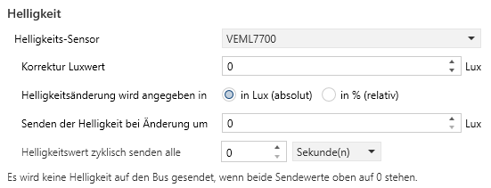</kbd>

<!-- DOC -->
#### **Korrektur Luxwert**

Erscheint nur, wenn ein Hardware-Helligkeitssensor ausgewählt ist.

Der vom Helligkeitssensor gemessene Luxwert kann hier korrigiert werden. Der auf den Bus gesendete Luxwert wird um den hier eingestellten Wert erhöht.

Wird 10 Lux eingestellt und 20 Lux gemessen, wird auf den Bus 30 Lux gesendet.
Wird -10 Lux eingestellt und 50 Lux gemessen, wird auf den Bus 40 Lux gesendet.
Für alle Werte, die rechnerisch einen negativen Wert ergeben, wird 0 Lux gesendet.

<!-- DOC -->
#### **Helligkeitsänderung wird angegeben in**

Die gemessene Helligkeit kann auf den Bus gesendet werden. Dazu muss man im nächsten Feld angeben, um welchen Wert sich die Helligkeit ändern muss, bevor sie gesendet wird. Die Änderung kann man absolut (in Lux) oder relativ (in %) angeben. Hier wählt man diese Angabe aus.

<!-- DOC -->
#### **Senden der Helligkeit bei Änderung um**

Die gemessene Helligkeit kann auf den Bus gesendet werden. Je nach Auswahl im vorherigen Feld (relativ oder absolut) kann man hier den Änderungswert eingeben bei dessen überschreiten auf den Bus gesendet wird.

##### **absolut (in Lux)**

Wird 10 Lux eingestellt und der letzte gesendete Wert war 50 Lux, dann wird ein neues Telegramm gesendet, sobald ein Wert kleiner oder gleich 40 Lux bzw. größer oder gleich 60 Lux gemessen wird.

##### **relativ (in %)**

Wird 10 % eingestellt und der letzte gesendete Wert war 50 Lux, dann wird ein neues Telegramm gesendet, sobald ein Wert kleiner oder gleich 45 Lux bzw. größer oder gleich 55 Lux gemessen wird, da 10% von 50 Lux genau 5 Lux entsprechen.

Unabhängig vom Senden der Werte auf den Bus kann die Helligkeit bei den Präsenzkanälen herangezogen werden.

<!-- DOC -->
#### **Helligkeitswert zyklisch senden**

Die gemessene Helligkeit kann auf den Bus gesendet werden. Mit dieser Einstellung wird das Zeitintervall zum erneuten Senden festgelegt.

Wird das Zeitintervall von 2 Minuten eingestellt, wird alle 2 Minuten die aktuell gemessene Helligkeit auf den Bus gesendet.

Wird während eines Zeitintervalls die Helligkeit wegen Änderung gesendet, so beeinflusst das nicht das Zeitintervall. Es kann somit passieren, dass kurz vor oder nach dem zyklischen Senden erneut wegen einer Änderung der Helligkeit gesendet wird.

> Wenn weder zyklisch noch aufgrund von einer Änderung gesendet werden soll (beide Werte auf 0), wird die Helligkeit gar nicht aktiv auf dem Bus gesendet. Sie kann immer noch über ein Lesetelegramm gelesen werden.

### LED

Erscheint nur, wenn irgendeine Präsenz-Hardware ausgewählt wurde.

<kbd></kbd>

<!-- DOC HelpContext="LED-Dropdown" -->
#### **LED Präsenz / LED Bewegung**

Die beiden Auswahlfelder **LED Präsenz** und **LED Bewegung** steuern vorhandene Hardware-LED. Für beide stehen folgende Auswahlmöglichkeiten zur Verfügung.

Unabhängig von der Einstellung kann für jede Tagesphase eines jeden Kanals eine Sperre für die LEDs eingestellt werden, die ein aufleuchten verhindert.

##### **nicht aktiv**

Die zugehörige LED wird nicht von der Firmware gesteuert.

##### **aktiv bei Bewegung**

Die zugehörige LED geht an, sobald von der Hardware eine Bewegung festgestellt wird und geht erst aus, nachdem die Hardware keine Bewegung mehr meldet.

##### **aktiv bei Präsenz**

Die zugehörige LED geht an, sobald von der Hardware eine Präsenz festgestellt wird und geht erst aus, nachdem die Hardware keine Präsenz mehr meldet.

Ein Präsenzsignal wird derzeit nur vom HF-Sensor erzeugt. Bei einem PIR-Sensor ist kein Präsenzsignal verfügbar.

##### **aktiv über externes Objekt**

Wird diese Einstellung gewählt, erscheint ein zusätzliches Kommunikationsobjekt, das die Steuerung dieser LED über den KNX-Bus erlaubt.

#### **Wert nach einem Neustart lesen?**

Erscheint nur, wenn eine LED über ein externes Objekt aktiviert werden soll.

<!-- DOC HelpContext="LEDs-nach-Neustart-lesen" -->
Wenn diese Funktion ausgewählt wird, werden nach einem Neustart passende Lesetelegramme gesendet, die den Zustand der LEDs abfragen.

## **HF-Sensor Konfiguration**

Der HLK-LD2420 (im Folgenden nur HLK genannt) ist ein HF-Sensor, der viele Möglichkeiten bietet, an den jeweiligen Raum angepasst zu werden und der sehr feine Bewegungen messen kann. Damit erlaubt er auch eine Nahezu-Präsenzerfassung, wie sie von bisherigen KNX-Präsenzmeldern bisher kaum erreicht wurde.

<kbd>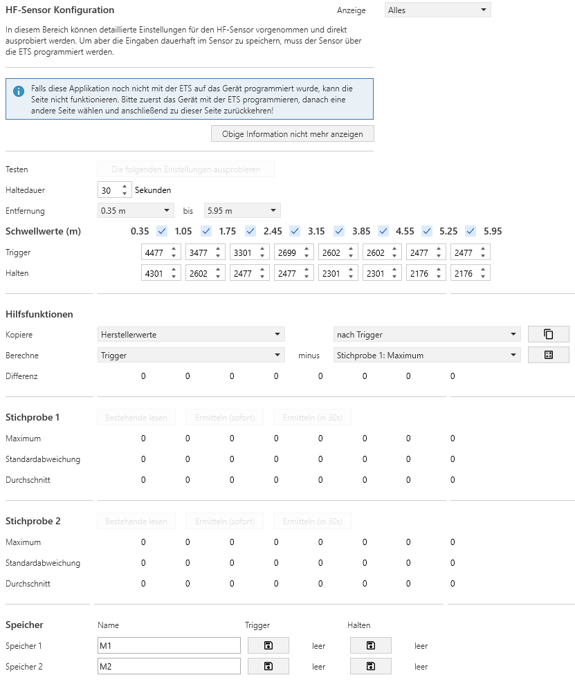</kbd>

Die Seite ist sehr komplex und deren Einstellungen werden im Folgenden schrittweise eingeführt. 

### **Allgemeine Informationen**

<!-- DOC -->
#### **Anzeige**

Um den Benutzer nicht gleich mit dem Inhalt zu überfordern, hat die Seite in der oberen rechten Ecke ein Auswahlfeld "Anzeige", mit dem man die angezeigten Bereiche bestimmen kann:

<!-- DOC Skip="1" -->
<kbd>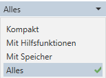</kbd>

* **Kompakt** - es werden nur die notwendigen Bereiche mit Schwellwerten und den beiden Stichproben angezeigt.
* **Mit Hilfsfunktionen** - zusätzlich zu Kompakt werden noch die Hilfsfunktionen angezeigt.
* **Mit Speicher** - zusätzlich zu Kompakt wird noch der Speicherbereich angezeigt.
* **Alles** - Es werden alle Arbeitsbereiche angezeigt.

#### **Informationsfeld zur Applikation**

<kbd>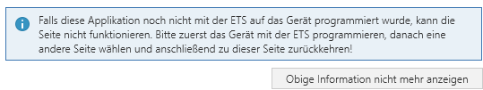</kbd>

Diese Applikation nutzt die neusten ETS-Möglichkeiten, um mit dem Präsenzmelder und dem darin verbauten Sensor direkt zu kommunizieren. Leider verhält sich die ETS hier nicht besonders Nutzerfreundlich. Aus diesem Grunde wird der obige Hinweis eingeblendet.

Damit diese Seite funktionieren kann, muss die Applikation auf das Gerät übertragen worden sein (das Gerät muss eine PA haben und programmiert worden sein). Technisch gesprochen muss über das Kommunikationsobjekt 1 (In Betrieb) in regelmäßigen Abständen eine "Ich lebe noch"-Meldung kommen. Wenn man das sichergestellt hat, kann man auf den Button "Obige Information nicht mehr anzeigen" klicken und die Information verschwindet für dieses Gerät für immer.

Folgende Indikatoren gibt es in der Applikation, dass diese Initiale Programmierung fehlt:

* Einige Buttons sind ausgegraut (wie im obigen Initialbild) - Dann ist noch nicht einmal eine PA zugewiesen worden
* Beim drücken auf einen Button kommt "Gerät nicht erreichbar"
* Nach einem Update der Applikation in der ETS wurde noch nicht wieder programmiert

Durch ein erneutes Programmieren kann das Problem gelöst werden.

<!-- DOC -->
### **Informationen zum Sensor**

Die Seite versucht, die möglichen Einstellungen verfügbar zu machen. Um sinnvoll Einstellungen vornehmen und den Sensor an die eigenen Bedürfnisse anpassen zu können, muss man aber dass Messprinzip verstehen.

Der HLK misst in 16 verschiedenen Entfernungsbereichen (vom Hersteller Ranges genannt) um seinen Einbauort "herum". Eine Range ist immer 70 cm. Die folgende Abbildung zeigt die ersten Ranges um den installierten Sensor (in der Bildmitte). Da der innere Range im Durchmesser 70 cm ist (blaue Linen), wir aber immer die Entfernungen vom Sensor zur Person betrachten, wirkt sich der erste Range nur in einer Entfernung von 35 cm aus (grüne Linie), alle folgenden Ranges dann mit 70 cm (braune Linien).

<!-- DOC Skip="3" -->
<kbd>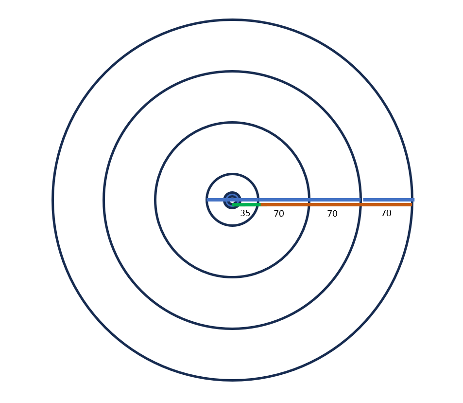</kbd>

Auch wenn die Darstellung Ringe als Ranges zeigt (2-Dimensional), muss man das räumlich (3-Dimensional) sehen, da sich HF-Signale Kugelförmig ausbreiten. Somit hat man bei Decken- oder Wandmontage keine Ringe, sondern Halbkugelschalen.

Für jeden dieser Ranges kann man 2 Werte Festlegen, bei denen der Sensor was machen soll: 
 
1. Einen oberen Trigger-Wert, der bei Überschreitung zum Einschalten führt. 
2. Einen unteren Halten-Wert, der bei Unterschreitung zum Ausschalten führt.

Das ist die aus KNX bekannte Hysterese-Funktion, nur wird die hier für bis zu 16 Ranges definiert.

Die Grundidee für das Messprinzip ist ganz einfach. Der Sensor misst einen Reflexionswert in einer bestimmten Entfernung, wie auch immer dieser ermittelt wird. Jetzt schaut er bei der passenden Hysterese-Einstellung in der entsprechenden Entfernung nach den 2 Werten:

1. Wird der Trigger-Wert überschritten, liefert der Sensor ein EIN-Signal
2. Wird der Halten-Wert unterschritten, liefert der Sensor ein AUS-Signal

Ein Mensch, der sich im Raum befindet, erhöht den Reflexionswert. Eine Bewegung im Raum erhöht den Reflexionswert sogar sehr stark. Dummerweise reflektieren aber auch alle anderen Dinge im Raum, so dass es immer einen Reflexionswert gibt (wir sprechen vom Grundrauschen). Man muss also immer passende Hysterese-Werte finden, die über dem Grundrauschen liegen und trotzdem die erhöhten Werte von Personen im Raum erkennen.

Eine weitere Schwierigkeit liegt in der Tatsache, dass nicht immer der gleiche Reflexionswert gemessen wird. Die Werte schwanken. Deswegen muss man auch mit einer Hysterese arbeiten.

Ferner will man nicht, dass ein kurzer Abfall des Reflexionswertes unter den Haltewert sofort zum AUS führt, wenn die Werte danach wieder über dem Haltewert liegen. Um so etwas zu vermeiden, benötigt man noch eine Haltezeit, die der Sensor im EIN-Zustand bleibt. Erst wenn alle Reflexionen unter dem Halten-Wert für die Haltezeit bleiben, liefert der Sensor ein AUS.

Als letzten Punkt muss es noch die Möglichkeit geben, die Ranges abzuschalten, aus den man keine Reflexionen messen will, weil diese Bereiche einen nicht interessieren. In einem Raum mit 5 m Durchmesser, bei dem der Sensor in der Mitte hängt, will man sicher nicht Entfernungen von mehr als 3 m berücksichtigen.

Mit den obigen Erklärungen sind die Begriffe auf dem oberen Teil des Einstellungen für den HLK eingeführt. Bei einer neuen Applikation sind die Werte für den Sensor mit den Standardeinstellungen des Herstellers ausgefüllt und können direkt so programmiert werden. Diese Einstellungen können funktionieren, müssen aber nicht.

<!-- DOC Skip="1" -->
<kbd>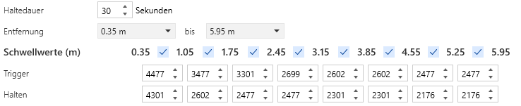</kbd>

<!-- DOC -->
### **Haltedauer**

Die Haltedauer bestimmt die Zeit, die der Sensor im EIN-Zustand verbleibt, auch wenn der gemessene Reflexionswert unter die Halten-Schwelle gesunken ist. Wird während der Haltedauer der Halten-Schwellwert erneut überschritten, startet beim nächsten Unterschreiten die Haltedauer erneut.

<!-- DOC -->
### **Entfernung**

Die Entfernung gibt dem Sensor den Bereich an, in dem er Präsenz erkennen soll. Außerhalb dieses Bereiches finden keine Messungen statt. Allerdings sollte man bedenken, dass Messwerte schwanken können und die Messung von Reflexionen nicht ganz exakt sein kann. Deswegen kann auch ein Objekt, dass knapp außerhalb des zu messenden Bereichs ist, eventuell doch noch erfasst werden.

### **Schwellwerte**

Die Schwellwert-Tabelle gibt die Entfernungsgrenzen der Ranges an und erlaubt in den Spalten dazwischen die Eingabe der entsprechenden Hysterese-Schwellwerte. Die Zahlen geben die jeweiligen Grenzen der Ranges an. Die Checkboxen zwischen den Zahlen erlauben es, eine ganze Spalte zu deaktivieren und so die Messung in dem Range zu verhindern.

<!-- DOC HelpContext="Spalte aktiv" -->
<!-- DOCCONTENT
Deaktiviert die ganze Spalte und verhindert die Messung in diesem Range
DOCCONTENT -->
<!-- DOCEND -->

<!-- DOC -->
### **Trigger**

Trigger ist der Wert, der in einem Range überschritten werden muss, damit der Sensor von einem AUS-Zustand in den EIN-Zustand wechselt. Ein Trigger sollte etwa 500 über dem maximalen gemessenen Reflexionswert einer Stichprobe liegen.

<!-- DOC -->
### **Halten**

Halten ist der Wert, der in einem Range für die Dauer der Haltezeit unterschritten werden muss, damit der Sensor von einem EIN-Zustand in den AUS-Zustand wechselt. Halten sollte nur in Ausnahmefällen niedriger sein als der Durchschnittswert der gemessenen Stichprobe.

### **Testen**

Die Sensoreinstellungen können mit dem Präsenzmelder direkt getestet werden, ohne eine vollständige Programmierung machen zu müssen. Dazu gibt es dem Button

<kbd>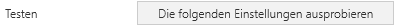</kbd>

Nach dem Drücken werden nur die Sensordaten an das Gerät übertragen und nach einer Totzeit von ca. 5 Sekunden läuft der Sensor mit den neuen Einstellungen. Das Gerät wird nicht neu gestartet. Man kann dann feststellen, ob die Präsenzerkennung zufriedenstellend ist und erneut testen.

>Wichtig: Die Testwerte bleiben im Sensor nur bis zum nächsten Neustart des Gerätes. Will man die Testwerte behalten, muss man das Gerät normal mit der ETS programmieren. Dadurch werden die Werte persistiert und bleiben erhalten.

## **Arbeitshilfen für die Sensoreinstellung**

Werte einzustellen, ohne dass man einen Bezug dazu hat und die einem nichts sagen, ist besonders schwer. Um eine gewisse Einschätzung zu erlauben, gibt es auf der HLK-Konfigurationsseite weitere Bereiche, die es Erlauben, die Werte besser zu beurteilen und so eine Einstellung ermöglichen.

### **Stichprobe**

Es gibt 2 Bereiche "Stichprobe", die gleich funktionieren. Es wird nur ein Bereich beschrieben.

<kbd>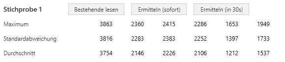</kbd>

Mit einer Stichprobe kann man vom Sensor das Grundrauschen in einem Raum ermitteln lassen. Die Stichprobe dauert ca. 30 Sekunden und kann auf 3 verschiedene Arten ermittelt werden:

1. Durch das Senden einer 1 an das KO 27 (HF-Stichprobe nehmen) und - nach ca. 30 Sekunden - betätigen des Buttons "Bestehende lesen".
2. Durch das Betätigen des Buttons "Ermitteln (sofort)". Die Ergebnisse werden nach ca. 30 Sekunden dargestellt.
3. Durch das Betätigen des Buttons "Ermitteln (in 30s)". Daraufhin warten die ETS erstmal 30 Sekunden, bevor die Stichprobenermittlung wie bei Punkt 2 startet. Dieser Modus ist dafür gedacht, dass man die Stichprobenermittlung mit der ETS starten kann und dann noch Zeit hat, den Raum zu verlassen.

In allen 3 Fällen sieht man in der ETS die gemessenen Reflexionswerte pro Range, für alle Ranges, die durch die Angabe der Entfernung berücksichtigt werden sollen. Es werden für jeden Range die folgenden Werte ermittelt.

<!-- DOC -->
#### **Maximum**

Das Maximum aller während der Stichprobe gemessenen Reflexionswerte für jeden Range.

<!-- DOC -->
#### **Standardabweichung**

Die Standardabweichung aller während der Stichprobe gemessenen Reflexionswerte für jeden Range. Genau genommen wird hier immer der Durchschnitt + Standardabweichung ausgegeben, die Standardabweichung ist somit die Differenz zwischen dem Feldinhalt und dem Durchschnitt. Diese Form der Ausgabe erlaubt eine einfachere Weiterverarbeitung.

<!-- DOC -->
#### **Durchschnitt**

Der Durchschnitt aller während der Stichprobe gemessenen Reflexionswerte für jeden Range.

### **Hilfsfunktionen**

Erscheint nur, wenn das Auswahlfeld Anzeige am Seitenanfang auf "Mit Hilfsfunktionen" oder auf "Alles" steht.

Der Bereich Hilfsfunktionen erlaubt die Berechnung von Sensoreinstellungen für Trigger und Halten anhand der ermittelten Stichproben. 

<kbd>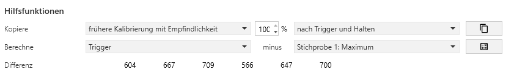</kbd>

Dabei gibt es 2 Funktionskategorien: Kopieren und Berechnen (Differenzbildung).

#### **Kopiere**

Die Kopierfunktion erlaubt es, Werte von verschiedenen Quellen nach Trigger, Halten oder beidem (Trigger und Halten) zu kopieren.

<kbd></kbd>

<!-- DOC HelpContext="Kopierziel" -->
* **nach Trigger** - Kopierziel ist nur Trigger
* **nach Halten** - Kopierziel ist nur Halten
* **nach Trigger und Halten** - Kopierziel ist Trigger und Halten
<!-- DOCEND -->

Als Kopier-Quelle stehen folgende Möglichkeiten zur Verfügung:

<kbd>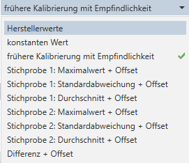</kbd>

<!-- DOC HelpContext="Kopierquelle" -->
* **Herstellerwerte** - Kopiert die Hersteller-Voreinstellung der Sensorwerte in das eingestellte Ziel
* **konstanten Wert** - Kopiert einen konstanten (eingebbaren) Wert in das eingestellte Ziel
* **frühere Kalibrierung mit Empfindlichkeit** - Kopiert die Werte, die die bisherige Kalibrierungsfunktion passend zur Empfindlichkeit ermittelt hat, in das eingestellte Ziel. Dabei kann die Empfindlichkeit angegeben werden. Dies ist für all diejenigen gedacht, die mit der bisherigen Firmware gute Ergebnisse erzielt haben und keine weiteren Einstellungen vornehmen wollen.
* **Stichprobe 1: Maximalwert + Offset** - Kopiert die ermittelten Werte für den Maximalwert der Stichprobe 1 zuzüglich eines eingebbaren Offsets in das eingestellte Ziel. Hier ist meist nur Trigger ein sinnvolles Ziel. Eignet sich z.B. um initial Stichprobe + 500 in alle Trigger zu übertragen.
* **Stichprobe 1: Standardabweichung + Offset** - Kopiert die ermittelten Werte für die Standardabweichung der Stichprobe 1 zuzüglich eines eingebbaren Offsets in das eingestellte Ziel. Hier ist meist nur Halten ein sinnvolles Ziel. Sollten die Durchschnittswerte dazu führen, dass der Sensor eine Dauerpräsenz erkennt, ist die Standardabweichung ein guter höherer Wert für passable Ergebnisse.
* **Stichprobe 1: Durchschnitt + Offset** - Kopiert die ermittelten Werte für den Durchschnitt der Stichprobe 1 zuzüglich eines eingebbaren Offsets in das eingestellte Ziel. Hier ist meist nur Halten ein sinnvolles Ziel. Eignet sich z.B. um initial Durchschnitt + 0 in alle Halten zu übertragen.
* **Stichprobe 2: xxxx** - analog zu den Stichprobe 1-Funktionen
* **Differenz + Offset** - Kopiert die berechneten Differenzwerte zuzüglich eines eingebbaren Offsets in das eingestellte Ziel. Das spart das manuelle Übertragen von berechneten Werten in die jeweiligen Ranges.
<!-- DOCEND -->

<!-- DOC -->
#### **Empfindlichkeit**

Bei der Kopierfunktion "frühere Kalibrierung mit Empfindlichkeit" kann man hier die Empfindlichkeit in % angeben. Es sind nur durch 10 teilbare Werte zugelassen.

<!-- DOC -->
#### **Offset**

Bei allen Kopierfunktionen mit Offset kann man hier den Offset (positiv oder negativ) angeben, der vor dem Kopieren zum Wert addiert werden soll.

#### **Berechne**

Die Berechnungsfunktion erlaubt die Differenzbildung zwischen den gelieferten Ergebnissen, um so die Reflexionswerte einfach vergleichen zu können.

Sowohl als Quelle wie auch als Ziel sind folgende Werte möglich:

<kbd>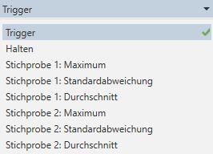</kbd>

<!-- DOC HelpContext="Berechne" -->
* **Trigger** - Es werden die Werte von Trigger genommen
* **Halten** - Es werden die Werte von Halten genommen
* **Stichprobe 1: Maximum** - Es werden die Werte vom Maximum der Stichprobe genommen
* **Stichprobe 1: Standardabweichung** - Es werden die Werte von der Standardabweichung der Stichprobe genommen
* **Stichprobe 1: Durchschnitt** - Es werden die Werte vom Durchschnitt der Stichprobe  genommen
* **Stichprobe 2: Maximum** - Es werden die Werte vom Maximum der Stichprobe genommen
* **Stichprobe 2: Standardabweichung** - Es werden die Werte von der Standardabweichung der Stichprobe genommen
* **Stichprobe 2: Durchschnitt** - Es werden die Werte vom Durchschnitt der Stichprobe  genommen
<!-- DOCEND -->

<!-- DOC -->
#### **Differenz**

Hier werden die Ergebnisse (Differenz) der Berechnung angezeigt.

### **Speicher**

Erscheint nur, wenn das Auswahlfeld Anzeige am Seitenanfang auf "Mit Speicher" oder auf "Alles" steht.

Der Bereich Speicher erlaubt es, die gerade eingestellten Werte für Trigger und Halten zwischenzuspeichern und später wiederzuverwenden. Hat man z.B. gute Werte gefunden, die man nicht verlieren möchte, kann man diese in einem von 2 Speichern zwischenspeichern, einige Versuche mit neuen Einstellungen machen (um z.B. die Erkennung von Präsenz bei stillem Sitzen zu verbessern) und kann sich hinterher entscheiden, ob man die neu gefundenen Einstellungen nicht wieder verwirft und mit den Einstellungen aus dem Speicher überschreibt.

<kbd>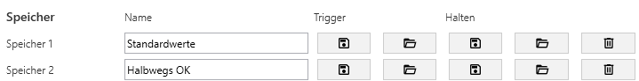</kbd>

Es gibt 2 gleichwertige Speicher, es wir nur eine beschrieben. Der 2. verhält sich analog.

<!-- DOC -->
#### **Name** 

Hier kann der Speicher benannt werden, damit man sich später erinnern kann, was in diesem Speicher gespeichert wurde.

#### **Trigger**

Die Spalte Trigger hat 2 Buttons mit Piktogrammen, die folgende Funktionen auslösen:

* **Disketten-Piktogramm** - Speichert alle Werte vom Trigger in den Trigger-Speicher.
* **Aktenmappen-Piktogramm** - Kopiert alle Werte vom Trigger-Speicher nach Trigger.

Die Spalte Halten hat 2 Buttons mit Piktogrammen, die folgende Funktionen auslösen:

* **Disketten-Piktogramm** - Speichert alle Werte von Halten in den Halten-Speicher.
* **Aktenmappen-Piktogramm** - Kopiert alle Werte vom Halten-Speicher nach Halten.

Für jeden Speicher gibt es auch noch

* **Mülleimer-Piktogramm** - Löscht den Trigger- und den Halten-Speicher.

### Vorgehen bei der Kalibrierung des HLK-Sensors

Bisher wurde das Messverfahren und die Einstellmöglichkeiten des HLK-Sensors beschrieben. Im Folgenden werden noch Vorschläge erarbeitet, wie man mit diesen Einstellmöglichkeiten in der Praxis umgeht. Das Verfahren wird Kalibrierung genannt, also das Finden der passenden Parameter für einen konkreten Raum und die individuelle Raumsituation.

>Wichtig: Die aus der bisherigen Firmware bekannte automatische Kalibrierung vom HLK gibt es nicht mehr. Man muss manuelle Einstellungen vornehmen. Welche Schritte notwendig sind, um das gleiche Ergebnis zu erreichen, wie die bisherige Kalibrierung, wird in einem Kapitel weiter unten beschrieben.

Bei der Kalibrierung sollte man immer die technischen Rahmenbedingungen berücksichtigen:

* Es gibt ein Grundrauschen, dass in jedem Raum pro Range unterschiedlich ist
* Eine Stichprobe gibt ein statistisches Abbild des Raumes nach 30 Sekunden Messung aus - das kann 5 Sekunden vorher oder 5 Sekunden hinterher schon wieder ganz anders aussehen
* Körper in Sensornähe liefern höhere Reflexionswerte als weiter entfernte, die Erkennbarkeit sinkt
* Eine hohe Haltezeit vermindert die Wahrscheinlichkeit, dass ungewollt ausgeschaltet wird, erhöht aber zwangsläufig die Nachlaufzeit des Präsenzmelders, denn dieser bekommt auf jeden Fall so lange vom Sensor ein Präsenzsignal geliefert, wie die Haltezeit läuft. 

Man muss für jeden relevanten Range die passenden Schwellwerte für Trigger und Halten finden. Dazu haben wir 2 Verfahren ausgearbeitet, die unterschiedlich arbeitsintensiv sind und beide zu guten bis sehr guten Erfolgen führen.

Für alle Verfahren sollte man folgendes Vorbereiten:

* Das Gerät muss eine PA haben und programmiert sein.
* Die Funktion "Präsenz-Rohdaten auf den Bus senden" sollte aktiviert sein.
* KO 21 (Ausgang Präsenz) und KO 23 (Ausgang Entfernung) sollten mit einer GA verknüpft sein
* Die GA Prasenz und Entfernung sollten im Gruppenmonitor beobachtet werden. Noch besser direkt auf dem Handy, z.B. über die App "EasyKNX", die kann in der Kostenlos-Version 3 GA nutzen.

#### **Kalibrierung mittels Stichprobe**

Dieses Verfahren führt sehr schnell zu guten Erfolgen, ist aber nicht dazu geeignet, kritische Bereiche gesondert zu behandeln. Es nutzt die Werte, die bei einer Stichprobe im leeren Raum ermittelt wurden. 

Das Vorgehen ist folgendermaßen:

1. Mit der ETS eine Stichprobe im leeren Raum nehmen.
2. Trigger mit einer Hilfsfunktion ermitteln (s.u.)
3. Halten mit einer Hilfsfunktion ermitteln (s.u.)
4. "Werte Testen"-Button betätigen.
5. Raum betreten, Zeit bis zum Einschalten beobachten über GA Präsenz
6. Raum verlassen, Zeit bis zum Ausschalten beobachten über GA Präsenz
7. Falls man nicht zufrieden ist, ab Punkt 2. mit anderen Werten erneut versuchen
8. Falls man zufrieden ist, das Gerät normal über die ETS programmieren.

Man kann auch nach mehreren Tagen nachkorrigieren, auch einzelne Werte Ändern usw. Die besten Ergebnisse erreicht man, indem man seine Gewohnheiten und die diesbezüglichen Reaktion des Sensors beobachtet und dann passend nachjustiert.

##### **Trigger ermitteln**

Für Trigger ist das relativ einfach: Da Bewegungen immer sehr hohe Reflexionswerte liefern und das Einschalten immer von einer Bewegung ausgelöst werden soll, kann man beim Trigger einfach Werte nehmen, die weit genug vom Maximum des Grundrauschens weg sind. Als Erfahrungswert hat sich hier "Maximum vom Grundrauschen im leeren Raum + 500" etabliert. Sollte wider Erwarten das Einschalten im leeren Raum trotzdem passieren, kann man den Wert auch auf 600 oder gar 1000 erhöhen. 

Je höher der Wert, desto größer muss die Bewegung sein, damit ein Einschalten erfolgt. Hierüber kann man also steuern, ob man mit dem ganzen Körper im Raum sein muss oder ob alleine die Bewegung der Türklinke reicht, um ein Einschalten auszulösen.

Vorgehen:

1. In der Auswahlbox "Anzeige" (oben links auf der Seite in der ETS) den Wert "Mit Hilfsfunktionen" oder "Alles" auswählen.
2. Kopiere "Stichprobe 1: Maximum" auswählen
3. In das Offset-Feld 500 eintragen
4. Als Ziel "nach Trigger" auswählen
5. Kopieren-Button drücken

Im Trigger stehen jetzt Werte, die um 500 größer sind als das Maximum der Stichprobe.

##### **Halten ermitteln**

Die Bestimmung des Schwellwertes für Halten ist der schwierigere Part, denn dieser Wert bestimmt, wie gut der Sensor eine sich nicht bewegende Person erkennt. Wenn der Sensor den Haltewert unterschreitet, wird allerdings nicht sofort ausgeschaltet, sondern noch die Haltezeit gewartet. Somit hängen die Werte für Halten auch von der Haltezeit ab:

* Bei langer Haltezeit (so ab 25 Sekunden) kann man davon ausgehen, dass das Grundrauschen den Durchschnitt der Stichprobe repräsentiert. Somit muss Halten höher als der Durchschnittswert gewählt werden, damit es nicht zur Dauerpräsenz kommt. Hier hat sich die Standardabweichung als guter Referenzwert erwiesen. Man kann damit anfangen und falls notwendig, sich in kleinen (50er) Schritten nach oben oder unten an eine gute Erkennung herantasten.

* Bei kurzer Haltezeit (2-5 Sekunden) liegen die meisten Reflexionswerte unter dem Durchschnitt, nur wenige liegen darüber. Die Wahrscheinlichkeit ist gering, dass in z.B. 3 Sekunden der gemessene Wert den ermittelten Durchschnitt der Stichprobe überschreitet. Und falls doch, dann wird er es in den nächsten 3 Sekunden nicht mehr tun und man hat mal eine etwas längere Haltezeit. Bei so kurzen Zeiten ist das kein Problem. Somit kann man bei kurzer Haltezeit den Durchschnitt als Halten-Wert nutzen und sich - falls Dauerpräsenz auftritt - in kleinen (50er) Schritten nach oben an eine gute Erkennung herantasten.

Vorgehen:

1. In der Auswahlbox "Anzeige" (oben links auf der Seite in der ETS) den Wert "Mit Hilfsfunktionen" oder "Alles" auswählen.
2. Kopiere "Stichprobe 1: Standardabweichung" (bei langer Haltezeit) bzw. "Stichprobe 1: Durchschnitt" (bei kurzer Haltezeit) auswählen
3. In das Offset-Feld 0 eintragen
4. Als Ziel "nach Halten" auswählen
5. Kopieren-Button drücken

#### **Kritische Räume**

Im folgenden sind noch einige potentiell kritische Räume aufgeführt, für die wir keine oder bisher wenige Testfälle haben, bei den wir aber Probleme befürchten:

* Uhr mit Pendel - hier wird Dauerbewegung erzeugt, das dürfte den Sensor stark triggern und sollte mit einem hohen Trigger-Wert ausgeblendet werden. Mangels einer solchen Uhr nicht getestet, diesbezügliches Feedback gewünscht.
* Kochtöpfe auf dem Herd - da diese aus Metall sind und gut reflektieren, könnten die zur Dauerpräsenz führen. Hier hat es geholfen, eine Stichprobe mit Töpfen auf allen 4 Kochplatten zu nehmen und mit diesen Werten den Halten-Wert zu ermitteln.
* Ventilator im Raum - Ungetestet, fall dieser beweglich ist, dürfte das ein unlösbares Problem sein 
* Waschmaschine - Ungetestet, sollte mit einem höheren Trigger- und Halten-Wert gut beherrschbar sein
* Metallmöbel - Unproblematisch. Ein Umstellen der Möbel in andere Range-Bereiche könnte aber zu Dauerpräsenz führen, dann müsste man neue Halten-Werte ermitteln.
* Wasserbett - Getestet und unproblematisch, allerdings werden auch kleine Bewegungen des Wasserbetts als Präsenz erkannt. Falls man also ein unberuhigtes Wasserbett hat, dass lange nachschwingt, dann wird für die Dauer des Nachschwingens Präsenz erkannt. 

## Grundsätzliche Funktion eines Präsenzkanals

Der Melder bietet gleichartige Präsenzkanäle, die ein bestimmtes Verhalten implementiert haben. Dieses Verhalten muss man verstehen, damit man die Melderkanäle sinnvoll parametrieren kann, so dass das Verhalten den Erwartungen entspricht.

### Interne Modi

Der Melder hat intern 4 Modi, die das gesamte Verhalten steuern. Folgende Tabelle erlaubt eine Übersicht über die Modi:

| Modus | Präsenz | Helligkeit | Zeit | Anmerkungen |
|---|---|---|---|---|
| Normal | wird beachtet | wird beachtet | Nachlaufzeit | Betrieb ohne externen Eingriff
| Auto | wird beachtet | wird ignoriert | Nachlaufzeit | Halbautomatischer Betrieb
| Manuell | wird ignoriert | wird ignoriert | Rückfallzeit * | Manueller Betrieb
| Sperre | wird ignoriert | wird ignoriert | Rückfallzeit | Langzeitsperre

*) Rückfallzeit kann auch präsenzabhängig parametriert werden

Die Tabelle zeigt, dass die üblichen Präsenzmelder-Einflussgrößen Präsenz und Helligkeit je nach Benutzerwunsch ignoriert werden können und so ein gewünschtes Verhalten erreicht werden kann.

Die Modi im Einzelnen am Beispiel vom geschalteten Licht:

#### **Normalmodus**

Im Normalmodus läuft der Melder die meiste Zeit. Helligkeit und Präsenz werden ausgewertet. Wenn es also dunkel ist und Bewegung im Raum ist, wird das Licht eingeschaltet. Wenn es wieder heller wird oder alle aus dem Raum raus sind, wird wieder ausgeschaltet, wobei vorher noch eine gewisse Nachlaufzeit gewartet wird. 

#### **Automodus** 

Man sitzt im Raum, möchte etwas arbeiten/lesen/spielen an einem verregneten Tag und es ist einem zu dunkel. Formal betrachtet ist es noch nicht zu dunkel laut der Parametrisierung des Melders, aber das subjektive Empfinden ist anders. Man will also das Licht einschalten, obwohl es für den Melder noch nicht zu dunkel ist. Würde man das Licht einfach so anmachen, würde er bei der nächsten Lichtmessung das Licht wieder ausmachen.

Versetzt man den Melder in den Modus **Auto EIN**, macht er das Licht an und ignoriert von da an die Helligkeitsmessung. Da der Melder immer noch die Präsenz auswertet, wird er das Licht ausmachen, sobald Präsenz + Nachlaufzeit abgelaufen sind.

Der gegenteilige Fall: Man sitzt abends am Tisch, Licht ist über den PM eingeschaltet worden, weil es zu dunkel ist und Präsenz vorhanden ist. Man möchte aber einen gemütlichen Abend bei Kerzenschein verbringen und das Licht ausschalten.

Versetzt man den Melder in den Modus **Auto AUS**, macht er das Licht aus und ignoriert von da an die Helligkeitsmessung. Da der Melder immer noch die Präsenz auswertet, wird er diesen Modus verlassen, sobald keiner mehr im Raum ist.

#### **Manuellmodus**

Je nach Präsenzhardware kommt man mit Parametrisierung irgendwann nicht mehr weiter: Es gibt dann Fälle, bei den die Präsenzerkennung nicht mehr ausreicht und man will den Schaltzustand, den man eingestellt hat, auf jeden Fall behalten. Dafür ist der Manuellmodus da. 

Wird der Melder in den Modus **Manuell EIN** versetzt, wird das Licht eingeschaltet und sowohl die Präsenz- wie auch die Helligkeitsinformation ignoriert. Damit bleibt das Licht auch an, wenn man sich gar nicht bewegt oder den Raum verlässt. Man muss also daran denken, den Modus auf Auto AUS zu wechseln.

Wird der Melder in den Modus **Manuell AUS** versetzt, wird das Licht ausgeschaltet und sowohl die Helligkeits- wie auch die Präsenzinformation ignoriert. Damit bleibt das Licht aus, bis der Melder wieder im Modus Auto EIN ist, egal ob sich jemand im Raum bewegt oder ob es dunkel wird. 

Da der Manuellmodus entgegen der üblichen Gewohnheiten arbeitet (Licht geht nicht automatisch aus bzw. Licht geht nicht automatisch an) und man als Mensch dazu neigt, die Fehler bei der Technik und nicht bei sich selbst zu suchen (obwohl man vergessen hat, den Melder vom Manuell- in den Auto-Modus zu versetzen), bietet der Manuellmodus noch eine Rückfallzeit, nach der dieser Modus trotzdem verlassen wird. Hat man also abends das Licht über Manuell EIN eingeschaltet (weil man lesen will und bereits weiß, dass das Licht sonst beim lesen ausgeht) und geht danach ins Bett, würde man nicht am nächsten Morgen in einen immer noch hell erleuchteten Raum kommen, da eine auf 4 Stunden eingestellte Rückfallzeit den Melder wieder in den Normalmodus versetzt hat.

<!-- DOC HelpContext="Praesenzkanal" -->
## **PM *x*: *...***

Hier werden alle kanalspezifischen Präsenzmelder-Einstellungen vorgenommen. Da alle Kanäle identisch sind, wird nur ein Kanal beschrieben.

Das *x* ist eine Zahl und steht für die Nummer des Kanals, der definiert wird.

Die drei Punkte **...** werden durch die Beschreibung des Kanals ersetzt, sobald eine Beschreibung vergeben wurde.

<!-- DOC Skip="1" -->
<kbd></kbd>

Auf der Hauptseite werden globale Einstellungen für den gesamten Kanal vorgenommen und die Anzahl der Tagesphasen definiert. Spezielle Tagesphasen-Einstellungen werden auf weiteres Unterseiten vorgenommen.

Ein Kanal kann nicht nur über Kommunikationsobjekte, sondern auch über Szenen gesteuert werden. Dafür steht eine weitere Seite "Szenensteuerung" zur Verfügung.

Für erfahrene Benutzer besteht noch die Möglichkeit, Präsenzmelder-Funktionen mit Logikfunktionen zu verknüpfen, ohne alle Telegramme über den Bus zu senden. Diese Funktionalität heißt "Interne Eingänge" und steht auf einer eigenen Seite zur Verfügung.

## Kanaldefinition

Die Angaben hier gelten zur Identifizierung und für das Grundverhalten des Kanals.

<kbd></kbd>

<!-- DOC -->
### **Beschreibung des PM**

Der hier angegebene Name wird an verschiedenen Stellen verwendet, um diesen Kanal wiederzufinden.

* Seitenbeschreibung des Kanals: Die drei Punkte **...** werden ersetzt
* Name vom Kommunikationsobjekt: Statt "PM *x*" wird der Text benutzt

Eine aussagekräftige Benennung erlaubt eine einfachere Orientierung innerhalb der Applikation, vor allem wenn man viele Kanäle nutzt.

<!-- DOC -->
### **Startverzögerung für diesen Kanal**

Neben "Allgemeine Parameter -> Zeit bis das Gerät nach einem Neustart aktiv wird" kann auch noch pro Kanal eine Startverzögerung sinnvoll sein.

Die Verzögerungszeit wird hier angegeben.

**Anmerkung:** Auch wenn man hier technisch bis zu 16.000 Stunden Verzögerung angeben kann, sind nur Einstellungen im Sekundenbereich sinnvoll.

<!-- DOC -->
### **Kanalaktivität**

Hier kann man einen PM-Kanal aktivieren.

#### **Inaktiv**

Dieser Kanal ist inaktiv. Alle Einstellungen und alle Kommunikaitonsobjekte sind ausgeblendet.

#### **Aktiv**

Dieser Kanal ist aktiv und kann normal parametrisiert werden.

#### **Funktionslos**

Dieser Kanal ist inaktiv. Er kann vollständig definiert sein und keine Einstellung geht verloren, aber es wird kein Telegramm empfangen oder gesendet. Dies bietet die Möglichkeit, zu Testzwecken einen bereits parametrierten Kanal inaktiv zu setzen, um zu schauen, ob er die Ursache für eventuelles Fehlverhalten im Haus ist. Kann zur Fehlersuche hilfreich sein.

## Helligkeit

Hier erfolgen die helligkeitsbezogenen Einstellungen für diesen Kanal.

<kbd></kbd>

<!-- DOC -->
### **Kanal ist Helligkeitsabhängig**

Ein PM-Kanal berücksichtigt normalerweise eine gemessene Helligkeit bei seinen Ein- und Ausschalt-Vorgängen. Es gibt auch Anwendungsfälle, die unabhängig von der Helligkeit funktionieren sollen, so ist z.B. das Ein- bzw. Ausschalten einer Klimaanlage bei Anwesenheit eher von der Temperatur als von der Helligkeit abhängig.

Wählt man hier Ja, wird die Helligkeit in den vorgegebenen Grenzen zum Schalten berücksichtigt, bei einem Nein wird keine Helligkeit berücksichtigt.

Die eigentlichen Helligkeitsgrenzen zum Ein- und Ausschalten sind abhängig von der Tagesphase und werden dort definiert.

<!-- DOC -->
### **Eingebauten Helligkeitssensor verwenden?**

Erscheint nur, wenn unter PM-Hardware ein Helligkeitssensor ausgewählt wurde.
Wenn hier ein Ja ausgewählt wurde, kann man die Helligkeit nicht mehr über ein Kommunikationsobjekt vorgeben. Die Helligkeitswerte werden vom internen Sensor gelesen.

<!-- DOC -->
### **Totzeit bis zur Helligkeitsanpassung**

<!-- DOC Skip="1" -->
Diese Einstellung ist nur wichtig, wenn die [adaptive Ausschaltschwelle](#adaptive-ausschaltschwelle-über-helligkeit) genutzt werden soll.

Ändert sich die Helligkeit im Raum, indem ein weiterer Lichtkreis ein-, ausgeschaltet oder gedimmt wurde, benötigt der entsprechende Helligkeitssensor eine gewisse Zeit, um die neue Helligkeit zu messen. Erst danach macht es Sinn, eine neue Ausschaltschwelle für das Licht zu berechnen.

Die hier angegebene Zeit ist die Pause, in der auf einen neuen Helligkeitswert gewartet wird.

Die Zeit sollte wohlüberlegt sein. Der interne Sensor benötigt für eine Lichtmessung ca. 5 Sekunden. Da intern keine Telegramme verloren gehen können, kann in diesem Fall 5 Sekunden angegeben werden.

Bei einem externen Helligkeitssensor sollte die Zeitspanne mindestens die Zeit sein, mit der der externe Sensor seine Helligkeit zyklisch sendet. Da Telegramme verloren gehen können, wird eher die doppelte Zykluszeit empfohlen. 
Wenn der externe Helligkeitssensor auf Lesetelegramme antwortet und beim lesen wirklich die aktuell gemessene Helligkeit zurückliefert (machen die wenigsten), kann man die Zeit auch kürzer angeben und für die Neuberechnung den Helligkeitswert lesen lassen.
<!-- DOCEND -->

> WICHTIG: Wenn man die [adaptive Ausschaltschwelle](#adaptive-ausschaltschwelle-über-helligkeit) nutzen will, ist es wichtig, dass nach dem einschalten einer neuen Lichtquelle auch ein neuer Helligkeitswert dem Melder vorliegt und er anhand dieses neuen Helligkeitswertes eine neue Ausschaltschwelle berechnen kann. Falls noch mit dem alten Helligkeitswert gerechnet wird, bleibt es bei der alten Ausschaltschwelle und das Licht wird möglicherweise sofort ausgeschaltet.

<!-- DOC -->
### **Nach Totzeit Lesetelegramm senden?**

Es kann sein, dass ein Helligkeitssensor während der Totzeit eine Helligkeitsänderung nicht von sich aus sendet. Um wirklich einen neuen Helligkeitswert zu erhalten, kann man den PM veranlassen, ein Lesetelegramm zu schicken.

Eine neue Ausschaltschwelle wird erst berechnet, nachdem ein Helligkeitswert empfangen wurde.

## Präsenz- und Bewegungseingänge

Hier kann bestimmt werden, ob eine Präsenz- bzw. Bewegungsinformation von externer oder interner Hardware zu dem Melderkanal gelangt.

<kbd></kbd>

Für die Nachlaufzeit werden alle Präsenz- oder Bewegungsinformationen über ein logisches ODER verarbeitet, eine Nachlaufzeit beginnt erst, wenn alle Präsenzeingänge eine 0 liefern.

Für die Kurzzeitpräsenz kann gewählt werden, ob die Präsenz- oder die Bewegungsinformation herangezogen werden, um die Kurzzeitpräsenz zu berechnen. Und für die Funktion "Raum verlassen" wird immer nur die Bewegungsinformation ausgewertet.

<!-- DOC -->
### **Eingebauten Präsenzsensor verwenden**

<!-- DOC Skip="1" -->
Erscheint nur, wenn unter PM-Hardware auch ein eingebauter Präsenzsensor ausgewählt wurde.

Folgendes kann ausgewählt werden:

* **nicht Verwenden** wenn kein Präsenzsensor in der Hardware enthalten ist oder man für diesen Kanal den internen Sensor nicht berücksichtigen möchte.
* **Bewegung** wenn man vom eingebauten Präsenzsensor nur das Bewegungssignal auswerten möchte.
* **Präsenz und Bewegung** wenn man von vom eingebauten Präsenzsensor sowohl das Präsenz- wie auch das Bewegungssignal auswerten möchte.

<!-- DOC -->
### **Eingänge für externen Melder**

Dieser Melder kann Präsenz- bzw. Bewegungssignale von externen Meldern verarbeiten. Die externen Melder sind dann Slaves, der (virtuelle) PM agiert als Master.

Die Auswahlliste erlaubt folgende Auswahl:

* **nicht aktiv** - der Melder hat keine Slave-Melder. Es muss die eingebaute Hardware zur Präsenzerkennung genutzt werden. Bei einem reinen virtuellen PM macht diese Einstellung keinen Sinn.
* **Präsenz** - Es wird nur ein Präsenzsignal vom externen Melder geliefert
* **Bewegung** - Es wird nur ein Bewegungssignal geliefert
* **Präsenz und Bewegung** - Es wird ein Präsenz- und Bewegungssignal vom externen Melder geliefert
* **Präsenz und weitere Präsenz** - Es werden 2 Präsenzmelder mit diesem Master verbunden.

Die Unterscheidung zwischen Präsenz- und Bewegungssignal ist rein theoretisch, da beides Bewegung im Raum anzeigt. Die Applikation geht davon aus, dass ein Präsenzsignal auf jeden Fall länger EIN ist als ein Bewegungssignal und es auch nicht so oft zwischen EIN und AUS wechselt. Ferner repräsentiert ein Präsenzsignal auch Mikrobewegungen (Hände beim Umblättern eines Buches) und nicht nur starke Bewegungen (aufstehen, gehen).
Ein Bewegungssignal repräsentiert eher starke Bewegungen und ist nur so lange EIN, wie diese Bewegung stattfindet.
Für die Applikation ist es somit erwartungskonform, wenn ein Bewegungssignal zuerst EIN wird, gefolgt von einem Präsenzsignal. Es ist aber nicht erwartungskonform, wenn das Präsenzsignal AUS geht, bevor die Bewegung AUS ist (Obwohl auch mit dieser Situation versucht wird, korrekt umzugehen).

Damit mehrere Slaves an den Melder ohne weitere Logik angeschlossen werden können, erlaubt jeder Eingang ein triggerndes Signal (sich wiederholende EIN-Signale). Bevorzugt werden aber schaltende Signale (EIN bei Bewegung/Präsenz, AUS bei deren Ende). Schaltende Signale erlauben kürzere Nachlaufzeiten und exaktere Einstellungen. Hat man mehrere schaltende Slaves, dann ist die Empfehlung, diese über ein ODER der enthaltenen Logik zusammenzuführen und dann als schaltendes Signal zu nutzen.

#### **Empfohlene Auswahl**

Diese Auswahlbox unterstützt einige klassische Konstellationen:

Ein Melder, dessen Nachlaufzeit sich nicht unter 30 Sekunden stellen lässt, sollte als **Präsenz** eingebunden werden.

Melder, die kurze Nachlaufzeiten kleiner 30 Sekunden erlauben, sei es dass es Präsenzmelder oder Bewegungsmelder sind oder klassische über einen Binäreingang eingebundene Melder, sollten mit **Bewegung** eingebunden werden. Gute Erfahrungen wurden mit einer Nachlaufzeit von 7 Sekunden gemacht.

Melder, die eine an sich gute Präsenzerkennung bieten aber auch kurze Nachlaufzeiten, sollten mit 2 Kanälen also **Präsenz und Bewegung** eingebunden werden, wobei der Präsenzkanal etwa 30 Sekunden und der Bewegungskanal 5 bis 7 Sekunden Nachlaufzeit haben sollte.

Einen Sonderfall nimmt hier der True Presence ein. Dieser sollte als **Präsenz und Bewegung** eingebunden werden und die Eingänge sollten mit den rohdaten des TP zur Präsenz und Bewegung verbunden werden (KO 81 und 82 vom TP)

Will man 2 schaltende Slaves anschließen und kein extra ODER spendieren, kann man dies über **Präsenz und weitere Präsenz** einbinden. Es sind hier auch triggernde Slaves denkbar, aber triggernde Slaves (auch mehr als 2) können bei **Präsenz** als hörende Adressen eingebunden werden.  

Wenn der virtuelle PM nur Präsenzinformationen bekommt, sind die Funktionen Kurzzeitpräsenz und Raum verlassen nur mit langen Nachlaufzeiten und somit mit weniger Komfort nutzbar.

<!-- DOC HelpContext="Eingang" -->
### **Eingang Präsenz / Bewegung / weitere Präsenz**

Es erscheint je ein Kommunikationsobjekt "Eingang Präsenz", "Eingang Bewegung", "Eingang weitere Präsenz", der das entsprechende Signal eines Slaves empfängt. 

Für jeden dieser Eingänge ist folgende Einstellung ist möglich: 

#### **schaltend (EIN und AUS wird ausgewertet)**

Der externe Sensor liefert das Signal als schaltendes Objekt. Solange ein EIN-Signal anliegt, ist Präsenz vorhanden, sobald ein AUS empfangen wird, ist die Präsenz weg und die Nachlaufzeit läuft an. Falls während der Nachlaufzeit ein erneutes EIN-Signal anliegt, wird die Nachlaufzeit zurückgesetzt und gestoppt. Beim darauffolgendem AUS läuft die Nachlaufzeit erneut an.

#### **triggernd (nur EIN wird ausgewertet)**

Der externe Sensor liefert das Signal als Trigger. Sobald ein EIN-Signal anliegt, ist Präsenz vorhanden und die Nachlaufzeit läuft an. Ein erneutes EIN setzt die Nachlaufzeit zurück, d.h. sie läuft erneut an. Ein AUS-Signal wird ignoriert.

Der externe Sensor muss sicherstellen, dass er valide Signale häufiger sendet als die minimale Nachlaufzeit, die verwendet wird. Empfohlen wird ein zyklisches senden, mindestens doppelt so häufig wie die geringste verwendete Nachlaufzeit (da die Nachlaufzeit abhängig von der Tagesphase ist und die Kurzzeitpräsenz auch eine Nachlaufzeit hat, muss die kürzeste Nachlaufzeit berücksichtigt werden).

> Achtung: Aus technischen Gründen wird bei triggerndem Betrieb das Eingangs-KO nach dem Empfangen einer 1 sofort wieder auf 0 gesetzt. Da dies ein Eingang ist, hat das üblicherweise keinerlei Auswirkungen. 

<!-- DOC HelpContext="kann nicht einschalten" -->
### **Eingang kann nicht einschalten, aber bestehende Präsenz verlängern**

Ein Eingang kann auch dazu genutzt werden, um bestehende Präsenz zu verlängern, ohne dass ein Signal an diesem Eingang irgendetwas einschaltet. 

Dies kann man nutzen, damit ein Hauptmelder einschaltet, der Zusatzmelder aber nur verlängernd wirkt.

<!-- DOC -->
### **Externer PM kann über Bus zurückgesetzt werden**

Manche externe PM können über ein KO zurückgesetzt werden. Auch wenn es in der Applikation als "Reset" bezeichnet wird, ist damit nicht die ETS-Funktion "Gerät zurücksetzen" gemeint, sondern die Möglichkeit, den PM in einen Zustand zu versetzen, der die aktuelle Präsenzerkennung und alle zugehörigen Nachlaufzeiten zurücksetzt und unmittelbar auf die nächste erkannte Bewegung bzw. Präsenz ein Signal schickt. Besitzt der externe Melder einen solchen Eingang, kann dieser für die erweiterten Funkionen wie "Kurzzeitpräsenz" oder "Raum verlassen" genutzt werden. 

In dem Eingabefeld gibt man an, ob der externe PM mit einem EIN-Signal oder einem AUS-Signal zurückgesetzt werden kann. 

Es erscheint ein KO "Externen PM zurücksetzen", das mit dem "Zurücksetzen"-Eingang des externen PM verbunden werden muss.

#### **Nein**

Wird dieser Wert in der Auswahlbox gewählt, kann der externe PM nicht über ein Telegramm zurückgesetzt werden.

#### **Mit einem EIN-Signal**

Wird dieser Wert in der Auswahlbox gewählt, kann der externe PM mit einem EIN-Signal zurückgesetzt werden. Der VPM schickt zu gegebener Zeit einen EIN-Trigger an den externen PM.

#### **Mit einem AUS-Signal**

Wird dieser Wert in der Auswahlbox gewählt, kann der externe PM mit einem 
AUS-Signal zurückgesetzt werden. Der VPM schickt zu gegebener Zeit einen AUS-Trigger an den externen PM.

## **Ausgänge**

Hier definiert man die Ausgänge für diesen Kanal.

<kbd></kbd>

Es gibt 2 Ausgänge, die identisch funktionieren. Hier werden nur die technischen Eigenschaften der Ausgänge spezifiziert. Welche konkreten Werte vom PM gesendet werden, wird von der jeweiligen Tagesphase bestimmt.

<!-- DOC HelpContext="Ausgang ist vom Typ" -->
### **Ausgang 1/2 ist vom Typ**

Hier wird der Datentyp des Ausgangs bestimmt. Folgende Werte sind möglich

#### **nicht aktiv**

Der Ausgang ist nicht aktiv und kann nichts senden. Das entsprechende Kommunikationsobjekt ist deaktiviert.

#### **Schalten (DPT 1.x)**

Der Ausgang ist schaltend.

#### **Wert (DPT 5.x)**

Der Ausgang sendet einen Wert 0..255.

#### **Szene (DPT 17.001)**

Der Ausgang sendet eine Szene.

#### **Dimmen absolut (DPT 5.001)**

Der Ausgang sendet einen Dimmwert 0%..100%.

## Sperre

Hier wird eingestellt, auf welche Art und Weise der Kanal gesperrt werden kann.

<kbd></kbd>

<!-- DOC -->
### **Sperrobjekt**

Man kann bei diesem Melder verschiedene Arten von Sperren definieren. Solange der Melder im Sperrmodus ist, sendet er keine Telegramme am Ausgang.

#### **nicht aktiv**

Die Sperre ist nicht aktiviert. Das entsprechende Kommunikationsobjekt ist deaktiviert.

#### **Zwangsführung**

Es wird ein Zwangsführungsobjekt DPT 2 sichtbar. Mit den entsprechenden Zwangsführungssignalen kann folgendes Verhalten bewirkt werden:

* normal, AUS (00) - Der Melder geht in den Automatik-Modus und schaltet aus
* normal, EIN (01) - Der Melder geht in den Automatik-Modus und schaltet ein
* priorität, AUS (10) - Der Melder geht in den Sperrmodus und schaltet aus
* priorität, EIN (11) - Der Melder geht in den Sperrmodus und schaltet ein

#### **Sperre**

Es wird ein Sperrobjekt DPT 1 sichtbar. Beim Empfang des entsprechenden Sperrsignals wird die Sperre aktiviert bzw. deaktiviert.

<!-- DOC -->
### **Sperraktivität**

Erscheint nur, wenn das Sperrobjekt "Sperre" eingestellt ist.

#### **gesperrt (1) / nicht gesperrt (0)**

Eine Sperre wird durch ein EIN-Telegramm ausgelöst, eine Freigabe durch ein AUS-Telegramm.

#### **gesperrt (0) / nicht gesperrt (1)**

Eine Sperre wird durch ein AUS-Telegramm ausgelöst, eine Freigabe durch ein EIN-Telegramm.

<!-- DOC -->
### **Beim EINschalten wird**

Erscheint nur, wenn das Sperrobjekt "Sperre" eingestellt ist.

Der Melder kann beim Aktivieren einer Sperre etwas senden lassen, hier wird bestimmt, was passiert.

> Achtung: Ein EIN- bzw. AUS-Signal ist nicht zu verwechseln mit einem EIN- oder AUS-Telegramm. Das entsprechende Signal wird am Ausgang in das passende Telegramm verwandelt, das in der aktuellen Tagesphase für  EIN- bzw. AUS-Signal gesendet werden soll. Ein EIN-Signal kann somit durchaus zu einer Szene 5 und ein AUS-Signal zu einer Szene 17 führen.

#### **nichts gesendet**

Beim Aktivieren der Sperre passiert nichts am Ausgang.

#### **AUS gesendet**

Beim Aktivieren der Sperre wird ein AUS-Signal gesendet.

#### **EIN gesendet**

Beim Aktivieren der Sperre wird ein EIN-Signal gesendet.

<!-- DOC -->
### **Beim AUSschalten wird**

Erscheint nur, wenn das Sperrobjekt "Sperre" eingestellt ist.

Der Melder kann beim deaktivieren einer Sperre etwas senden lassen, hier wird bestimmt, was passiert.

> Achtung: Ein EIN- bzw. AUS-Signal ist nicht zu verwechseln mit einem EIN- oder AUS-Telegramm. Das entsprechende Signal wird am Ausgang in das passende Telegramm verwandelt, das in der aktuellen Tagesphase für  EIN- bzw. AUS-Signal gesendet werden soll. Ein EIN-Signal kann somit durchaus zu einer Szene 5 und ein AUS-Signal zu einer Szene 17 führen.

#### **nichts gesendet**

Beim Deaktivieren der Sperre passiert nichts am Ausgang.

#### **AUS gesendet**

Beim Deaktivieren der Sperre wird ein AUS-Signal gesendet.

#### **EIN gesendet**

Beim Deaktivieren der Sperre wird ein EIN-Signal gesendet.

#### **Aktueller Zustand gesendet**

Beim deaktivieren der Sperre wird das Signal gesendet, dass gerade am Ausgang anliegen würde, wenn der Melder nicht gesperrt gewesen wäre.

Somit funktioniert ein gesperrter Melder intern normal weiter und sendet einfach nur keine Telegramme. Bei dieser Einstellung wird beim Entsperren einfach das letzte unterdrückte Signal gesendet.

<!-- DOC -->
### **Mit Rückfallzeit?**

Werden Sperren bzw. eine Zwangsführung manuell geschaltet, so ist es nicht ungewöhnlich, dass vergessen wird, diese Sperre/Zwangsführung wieder zu beenden. Vor allem, wenn die Sperre/Zwangsführung mit einem AUS verbunden wird, denkt man nicht mehr dran, die Sperre aufzuheben.

Mit dieser Einstellung kann man eine Rückfallzeit aktivieren, nach der der Melder von sich aus die Sperre aufhebt und wieder in den Normalbetrieb geht.
<!-- DOCEND -->

Bei der Aufhebung einer Sperre wird die unter [Beim AUSschalten wird](#beim-ausschalten-wird) definierte Aktion ausgeführt.
Bei der Aufhebung einer Zwangsführung wird in den Zustand "normal, AUS" gesprungen.

<!-- DOC -->
### **Rückfall nach**

Hier wird die Rückfallzeit angegeben.

## Tagesphasen

Die Definition der Tagesphasen macht eine wesentliche Funktion des Melders aus.

<kbd></kbd>

Hier werden nur die Anzahl, die Namen und das Verhalten der Tagesphasen definiert, die einzelnen Tagesphasen werden auf eigenen Seiten festgelegt.

Es muss mindestens eine Tagesphase gewählt werden. Diese beinhaltet dann alle Schalteinstellungen. Mit nur einer Tagesphase verhält sich der Melder wie ein "normaler" Melder, der nicht einmal einen Unterschied zwischen Tag und Nacht macht. Der Standard-Name für nur eine Tagesphase ist "Tag", dieser kann natürlich geändert werden.

<!-- DOC -->
### **Anzahl Tagesphasen**

Hier wird die Anzahl der Tagesphasen angegeben, es muss mindestens eine Tagesphase geben. Das Maximum sind 4 Tagesphasen.

Sobald mehr als eine Tagesphase möglich ist, wird ein zusätzliches Kommunikationsobjekt "Tagesphase" freigeschaltet, dass eine Szene empfangen kann. Tagesphasen können somit über Szenen umgeschaltet werden.

<!-- DOC -->
### **Neue Tagesphase übernehmen**

Erscheint nur bei mehr als einer Tagesphase.

Sobald man zwischen verschiedenen Tagesphasen umschalten kann, kann man hier festlegen, wann die neuen Einstellungen der Tagesphase gültig sein sollen.

#### **Bei Zustandswechsel am Ausgang**

Eine neue Tagesphase kann vielleicht eine neue Ausschaltschwelle oder eine kürzere Nachlaufzeit definieren. Damit diese neuen Einstellungen sich nicht sofort auswirken und das aktuelle Ambiente stören, kann man mit dieser Einstellung bestimmen, dass die Einstellungen der neuen Tagesphase erst gelten, sobald sich sowieso was ändert: Wenn nämlich der Ausgang auf einen anderen Wert schaltet. Diese Einstellung wirkt nicht so "bevormundend" und homogener vom Gesamtverhalten her.

#### **Sofort beim Wechsel der Tagesphase**

Die Einstellungen der neuen Tagesphase werden sofort übernommen.

Hat die neue Tagesphase eine höhere Einschaltschwelle und die aktuelle Helligkeit ist niedriger als diese Schwelle, würde das Licht sofort angehen. Hat die Tagesphase z.B. eine kürzere Nachlaufzeit von 2 statt 5 Minuten und es sind bereits 3 Minuten Nachlaufzeit vergangen, würde das Licht sofort ausgehen.

<!-- DOC HelpContext="Tagesphasentabelle" -->
### **Phase, Name, Szene**

In der folgenden Tabelle kann jeder Phase ein Name zugewiesen werden und eine Szene, über die diese Phase aufgerufen werden kann.

Die Namen der Phasen können frei gewählt werden und sollten möglichst sprechend die Rolle der Phase repräsentieren. Eine Phase, die lange Nachlaufzeiten hat, weil sie für langes und ruhiges Sitzen am Schreibtisch gedacht ist sollte eher "Büroarbeit" oder "Hausaufgaben" heißen als "Szene 7".

<!-- DOC Skip="1" -->
<kbd></kbd>

Zur Orientierung erscheinen die Namen auf den Seiten, die diese Phasen definieren.

<!-- DOC HelpContext="Tag-Nacht-Objekt" -->
## Spezialfall Tag-/Nacht-Objekt

Für diejenigen, die nur ein einfaches Tag-/Nacht-Objekt haben wollen, das über ein normales Schaltobjekt umgeschaltet werden kann, bieten die Tagesphasen eine zusätzliche Einstellmöglichkeit.

<!-- DOC Skip="1" -->
<kbd></kbd>

Hier müssen genau 2 Tagesphasen gewählt werden. Ferner muss die Einstellung **Tagesphasen über Tag-/Nacht-Objekt verfügbar machen?** auf Ja gestellt werden.

Dadurch wird statt dem Kommunikationsobjekt "Tagesphase" mit DPT 17.001 ein Kommunikationsobjekt "Tagesphase" mit DPT 1.001 angeboten. Ferner wird der Wert 0 fest der Phase 1 und der Wert 1 fest der Phase 2 zugeordnet.
<!-- DOCEND -->

Ob Phase 1 die Bedeutung "Tag" und Phase 2 die Bedeutung "Nacht" hat, wie im Beispiel dargestellt, oder ob man das umkehrt, indem man die Texte entsprechend ändert oder ob man die beiden Phasen komplett anders benennt, bleibt dem Benutzer überlassen.

## Raum verlassen

Dies ist eine Sonderfunktion, die sich nur beschränkt mit externen Bewegungsmeldern realisieren lässt. **Sie eine Versuchsreihe, damit es zufriedenstellend funktioniert.**

Der Abschnitt erscheint nur, wenn

* beim Betrieb mit externen Melder(n)
  * die Melder zurückgesetzt werden können (Reset)
  * oder zumindest zusätzlich zur Präsenz auch Bewegung melden können
* beim Betrieb mit internem Melder
  * der interne Melder Präsenz und Bewegung melden kann (macht der von uns unterstützte HF-Melder)
  * der interne Melder ein PIR-Melder ist

Mit "Bewegung melden" sind kurzzeitige Bewegungsmeldungen gemeint, die schaltend sind und idealerweise **Stillstand** schon nach weniger als 5 Sekunden, spätestens nach 15 Sekunden melden.

Beim True Presence sollte man an der konkreten Einbaustelle testen, wie schnell der Ausgang für die Bewegungs-Rohdaten nach einer Bewegung wieder auf AUS geht. Aus dem Test ist bekannt, dass hier Werte zwischen 5 und 40 Sekunden erreicht werden. Wird Stillstand erst nach 30-40 Sekunden gemeldet, wird die Raum Verlassen Funktion nicht zufriedenstellend funktionieren und dann nicht empfohlen. Versuchen kann man es natürlich trotzdem, da solche Komfortfunktionen sehr vom eigenem empfinden abhängen.

<kbd></kbd>

Folgende Situation wird adressiert: Man verlässt einen Raum oder einen Bereich und macht per Taster das Licht aus. Wenn man z.B. abends zu Bett geht, spricht nichts dagegen, das Licht auszumachen anstatt die entsprechenden Nachlaufzeiten abzuwarten. Kaum ist man im Schlafzimmer angelangt, stellt man fest, dass man sein Handy vergessen hat. Jetzt geht man in den Raum zurück und möchte eigentlich dass jetzt erneut das Licht angeht, genauer gesagt sogar dass die Kurzzeitpräsenz wirkt.

Leider ist die Aktion "Licht aus" beim Verlassen des Raumes die gleiche wie "Licht aus" zum Fernsehen, bei der ich im Raum bleibe und einfach möchte, dass das Licht so lange aus bleibt, wie ich in diesem Raum bin und fernsehe.

Da beide Aktionen konkurrierend sind, gibt es die Möglichkeit, ein "Raum verlassen" direkt über eine Szene aufzurufen (siehe [Szenensteuerung](#szenensteuerung)). Für den einfachen Tastendruck kann man sich hier entscheiden, wie der Melder bei "Licht aus" reagieren soll, indem man den Tastendruck an "Automatik übersteuern" sendet oder als Szene "Raum verlassen".

### **Wie funktioniert "Raum verlassen"?**

Ziel: Ich verlasse den Raum und sage das dem Melder durch einen Tastendruck. Vereinfacht gesagt soll der Melder dann intern zurückgesetzt werden, wie nach dem Einschalten. Dadurch würde er die nächste Bewegung/Präsenz detektieren (das wäre beim erneuten Betreten) und normal in Kurzzeitpräsenz, dann in Langzeitpräsenz etc. gehen, so wie er eben parametriert ist.

Da die vorliegende Applikation ein virtueller Präsenzmelder (VPM) ist, ist das eigentliche präsenzerfassende Gerät ein externes KNX-Gerät, auf dessen Hardware man keinen Zugriff hat. Dieses externe Gerät würde also potentiell noch 60 oder mehr Sekunden lang Präsenz melden. Aus Sicht des VPM würde dieser nach seinem lokalen Reset also sofort eine Präsenz empfangen und damit das Licht wieder anmachen, was sicherlich nicht erwünscht ist.

Da man zu dem Zeitpunkt, in dem man die "Raum verlassen"-Taste drückt, wahrscheinlich noch im Raum ist, kann noch eine kurze Totzeit eingestellt werden, die der Melder nach dem Befehl wartet, bevor er den Reset macht.

Alternativ kann man den Melder warten lassen, bis das Bewegungssignal (nicht das Präsenzsignal) auf AUS geht (mal also wirklich nicht mehr im Raum ist) zuzüglich einer kurzen Sicherheitspause in Form einer Totzeit, um erst dann bei der nächsten Bewegung wieder zu reagieren. 

Es muss aber klar sein, dass der VPM hier nicht "zaubern" kann. Wird nach der Totzeit ein erneutes Bewegungssignal an den Melder gesendet, obwohl keiner im Raum ist (weil z.B. der externe Melder zyklisch sendet), wird das Licht eingeschaltet. Wird hingegen der Raum verlassen und erneut betreten, während die Totzeit noch läuft, wird das Licht nicht automatisch eingeschaltet. Insofern kann diese Funktion nur unterstützend wirken und den Komfort erhöhen, aber nicht alle denkbaren Szenarien abdecken.

<!-- DOC -->
### **Modus für Raum verlassen**

Über das Auswahlfeld kann man das Verhalten für Raum verlassen genauer vorgeben

#### **Raum verlassen inaktiv**

Die Funktion "Raum verlassen" wird nicht genutzt

#### **Totzeit**

Nach dem Aufruf von "Raum verlassen" wird eine gewisse Zeit gewartet und anschließend bei den nächsten Bewegung wieder die normale PM-Funktion gestartet. 

> Sollte die Totzeit zu kurz gewählt sein und es befindet sich noch jemand im Raum, würde das Licht direkt nach der Totzeit wieder eingeschaltet werden.

#### **Bewegung + Totzeit**

Nach dem Aufruf von "Raum verlassen" wird gewartet, bis das Bewegungssignal (nicht das Präsenzsignal) auf AUS geht. Danach wird die Totzeit gewartet und anschließend wieder zur normalen PM-Funktion gesprungen.

<!-- DOC -->
### **'Automatik übersteuern'=AUS heißt 'Raum verlassen'**

Bei "Nein" wird ein "Licht aus" im Automatikmodus als "Licht ausschalten solange Präsenz im Raum festgestellt wird" interpretiert (das obige Beispiel "Fernsehen"). Da Nachlaufzeiten üblicherweise größer 60 Sekunden sind, wird erst nach dem Ablaufen der Nachlaufzeit ohne Präsenz das Licht erneut angehen.

Bei "Ja" wird ein "Licht aus" im Automatikmodus als "Raum verlassen" interpretiert. Der Bewegungsmelder stoppt jegliche Präsenzerkennung und löscht jegliche Nachlaufzeit (interner Reset). Bei der nächsten Bewegung geht das Licht wie erwartet wieder an.

<!-- DOC -->
### **Totzeit nach Raum verlassen**

Da ein "Raum verlassen" dazu führt, dass jegliche Nachlaufzeiten und die aktuelle Präsenzerkennung gestoppt werden und danach der Melder sofort versucht, erneute Präsenz zu erfassen, kann es passieren, dass man den Raum noch gar nicht verlassen hat, nachdem man die "Raum verlassen" Taste gedrückt hat (z.B. steht man noch in der Tür). Das Licht würde somit sofort wieder angehen. Um das zu verhindern, gibt man hier eine Totzeit an, in der der Präsenzmelder auf keine Signale bzw. Präsenzen reagiert.

## **Manuell übersteuern**

Das Kommunikationsobjekt "Manuell übersteuern" erlaubt es, die Automatik des PM zu übersteuern und einen Wert (EIN oder AUS) vorzugeben. Diese Funktion kann man auch als Kurzzeitsperre interpretieren, denn solange die Funktion aktiviert ist, ist die Automatik abgeschaltet. Manuelles übersteuern wird beendet, indem man ein Telegramm an das Kommunikationsobjekt "Automatik übersteuern" sendet.

Wenn man für Lichtsteuerung einen 2-Tasten-Bedienung wählt (Wippe), dann kann man hervorragend die Wippe auf Kurz-/Lang-Betätigung stellen und dann die Kurzbefehle auf die "Automatik übersteuern" legen und die Langbefehle auf "Manuell übersteuern". Man erhält folgende komfortable Kombinationen:

* Kurz AN - Schaltet das Licht im Automatik-Modus ein (Licht geht ohne Präsenz nach der Nachlaufzeit aus)
* Kurz AUS - Schaltet das Licht im Automatik-Modus aus (Licht geht so lange nicht an, wie Präsenz + Nachlaufzeit eingestellt sind)
* Lang AN - Schaltet das Licht im Manuell-Modus ein (Licht bleibt an, bis es wieder ausgeschaltet wird)
* Lang AUS - Schaltet das Licht im Manuell-Modus aus (Licht bleibt aus, bis es wieder eingeschaltet wird)

Der Melder erlaubt es auch, ein ähnliches Konzept mit einer Ein-Tasten-Bedienung komfortabel zu realisieren. Man nutzt eine einzelne Taste mit Kurz-/Langbedienung, wobei beide als Umschalter (UM) parametriert sind. Wieder werden die Kurzbefehle mit "Automatik übersteuern" verbunden und die Langbefehle mit "Manuell übersteuern". Der Status fürs Umschalten der Kurzbefehle muss mit dem Aktorstatus des Lichtkreises verbunden werden. Der Status der Langbefehle mit dem Kommunikationsobjekt "Status Auto/Manuell". Man erhält folgende komfortable Kombinationen:

* Licht ist aus - Kurz drücken - Schaltet das Licht im Automatik-Modus ein (Licht geht ohne Präsenz nach der Nachlaufzeit aus)
* Licht ist an - Kurz drücken - Schaltet das Licht im Automatik-Modus aus (Licht geht so lange nicht an, wie Präsenz + Nachlaufzeit eingestellt sind)
* Manuell-Modus ist aus - Lang drücken - Das Licht bleibt im aktuellen Zustand (AN oder AUS), Melder geht in den Manuell-Modus und schaltet so das Licht nicht mehr, bis Manuell-Modus aufgehoben wurde.
* Manuell-Modus ist an - Lang drücken - Das Licht bleibt im aktuellen Zustand (AN oder AUS), Melder geht in den Automatik-Modus und macht das Licht nach entsprechender Präsenz + Nachlaufzeit wieder AUS/AN.

<kbd></kbd>

Der Manuell-Modus wir immer verlassen, wenn durch eine Taste oder eine Szene der Automatik-Modus gewählt wird.

<!-- DOC -->
### **Tastenmodus für 'Manuell übersteuern'**

Hier wird der Tastenmodus für die Funktion 'Manuell übersteuern' festgelegt. Unabhängig vom Tastenmodus gilt, dass ein beliebiges Telegramm am Kommunikationsobjekt 'Automatik übersteuern' oder eine beliebige 'Automatik'-Szene den Manuell-Modus abschaltet und wieder den Automatik-Modus aktiviert.

#### **Eintastenbedienung**

Bei der Eintastenbedienung schaltet ein EIN am Kommunikationsobjekt 'Manuell übersteuern' den Manuell-Modus ein, ohne den Schaltstatus am Ausgang zu beeinflussen. Ein AUS an dem Kommunikationsobjekt verlässt den Manuell-Modus und aktiviert wieder den Automatik-Modus. Auch hierbei wird der Schaltstatus am Ausgang nicht verändert. 

#### **Zweitastenbedienung**

Bei der Zweitastenbedienung schaltet jedes Telegramm am Kommunikationsobjekt 'Manuell übersteuern' den Manuell-Modus ein. Ist es ein EIN-Telegramm, wird zusätzlich ein EIN-Signal gesendet. Ist es ein AUS-Telegramm, wird zusätzlich ein AUS-Signal gesendet.

## **Phase *n*: Phasenname**

Der Platzhalter *n* wird ersetzt durch die Nummer der Tagesphase (1 bis 4), der *Phasenname* durch den vom Benutzer gewählten Namen der Phase. Von der Applikation vorgegebene Namen sind "Tag", "Nacht", "Morgen" und "Abend".

<!-- DOC HelpContext="Tagesphase" -->
Eine Tagesphase dient dazu, das Verhalten des Präsenzmelders zu einem bestimmten Teil des Tages zu definieren. Häufig wird die Tagesphase durch Zeitschaltuhren oder das Tag-Nacht-Objekt bestimmt, sie kann aber auch durch einen Tastendruck (z.B. "Schlafen") gesetzt werden.
<!-- DOCEND -->

<kbd></kbd>

Da alle Seiten zur Definition von Tagesphasen gleich sind, wird hier nur eine Seite beschrieben.

## Funktion

Eine Tagesphase kann als Halb- oder Vollautomat funktionieren. 

<kbd></kbd>

Es gibt drei denkbare Funktionen, die alle implementiert sind. 

* Standardmäßig wird die Tagesphase dazu genutzt, das Licht sowohl ein- wie auszuschalten.
* Man möchte nur manuell einschalten und es wird automatisch ausgeschaltet.
* Man möchte automatisch einschalten und es wird manuell ausgeschaltet.

<!-- DOC -->
### **Funktion der Tagesphase**

In dieser Auswahlbox wird die Funktion der Tagesphase bestimmt.

#### **Automatisch Ein- und Ausschalten**

Die Standardeinstellung, in der der Melder sowohl ein- wie auch ausschalten kann.

#### **Manuell Ein-, automatisch Ausschalten**

In dieser Einstellung wird das Licht mittels eines EIN-Signals auf den Eingang 'Automatikmodus überschreiben' oder eine Szene eingeschaltet werden. Ausgeschaltet wird es über Helligkeit oder Präsenz (bzw. Nichtpräsenz).
Eine Tagesphase "Nacht" würde z.B. mit dieser Einstellung kein Licht einschalten, aber durchaus ausschalten, falls es über einen Taster eingeschaltet wurde. 

#### **Automatisch Ein-, manuell Ausschalten**

In dieser Einstellung wird das Licht vom Präsenzmelder anhand von Präsenz- und Helligkeitsinformationen eingeschaltet, muss aber über ein AUS-Signal auf den Eingang 'Automatikmodus überschreiben' oder eine Szene ausgeschaltet werden. 

## Helligkeit

Die Helligkeitsangaben pro Tagesphase beziehen sich nur noch auf ein Ein- uns Ausschaltschwelle.

<kbd></kbd>

<!-- DOC -->
### **Einschalten: Unterhalb welcher Helligkeit**

Hier wird ein Luxwert eingegeben. Sinkt die gemessene Helligkeit unter diesen Wert, wird bei Präsenz ein EIN-Signal generiert. Die Einstellungen am Ausgang bestimmen dann, welches Telegramm gesendet wird.

<!-- DOC -->
### **Ausschalten über Helligkeit**

Hier kann man bestimmen, ob ein Ausschalten über Helligkeit gewünscht wird.

#### **nicht aktiv**

Bei der Einstellung wird nicht über Helligkeit ausgeschaltet, sondern nur über Präsenz (bzw. Nichtpräsenz).

#### **absolute Schwelle**

Dies ist ein klassisches Ausschaltverhalten über eine absolute Schwelle. Es wird angegeben, um wie viel es heller werden darf. Überschreitet der gemessene Helligkeitswert diese Schwelle, wird auch bei Präsenz ein AUS-Signal generiert. Da nicht festgestellt werden kann, ob die Helligkeitsüberschreitung durch Sonnenlicht oder durch weitere Lichtquellen erfolgt ist, kann es passieren, dass das Licht ausgeschaltet wird, nachdem man weitere Lichtquellen eingeschaltet hat. Deswegen sollte hier ein hoher Luxwert stehen, sprich: Es muss viel heller werden, bevor Licht über Helligkeit ausgeschaltet wird.

#### **adaptive Schwelle**

Diese Einstellung wählt die neue und innovative adaptive Ausschaltschwelle, die in diesem Melder implementiert ist. 

<!-- DOC Skip="1" -->
Siehe [adaptive Ausschaltschwelle](#adaptive-ausschaltschwelle-über-helligkeit).

Damit diese korrekt und erwartungskonform funktionieren kann, ist es unbedingt notwendig, dass der Melder von allen Lichtquellen, die die Helligkeit in dem Raum beeinflussen können, entsprechende Informationen über Helligkeitsänderungen bekommt. Dazu muss

* am Kommunikationsobjekt 'Änderung schalten' der Aktorstatus einer jeden Lichtquelle verbunden sein (als hörende Adresse)
* am Kommunikationsobjekt 'Änderung relativ dimmen' alle Dimmadressen einer jeden Lichtquelle verbunden sein (als hörende Adresse)
* am Kommunikationsobjekt 'Änderung absolut dimmen' alle Dimmstatus-Adressen einer jeden Lichtquelle verbunden sein (als hörende Adresse)
* am Kommunikationsobjekt 'PM über Szene steuern' alle Szenen-Adressen aller Lichtquellen, die die Helligkeit beeinflussen, verbunden sein.
* In der Szenensteuerung alle helligkeitsverändernden Szenen aufgelistet sein mit der Funktion 'ändert Helligkeit im Raum'

Dies ist die Maximalforderung für eine sofortige und unmittelbare Reaktion des Melders. Technisch sollte es reichen, alle Lichtquellen-Aktoren-Status mit 'Änderung schalten' und 'Änderung absolut dimmen' zu verbinden.

<!-- DOC -->
### **Ausschalten: Wie viel heller darf es werden**

Hier wird ein Luxwert eingegeben. Dieser Luxwert wird nach dem Einschalten zur aktuellen Helligkeit im Raum addiert und so die Ausschaltschwelle bestimmt.

Bei der adaptiven Ausschaltschwelle wird dieser Luxwert nach jeder beabsichtigten Helligkeitsänderung zur aktuellen Helligkeit addiert und so die Ausschaltschwelle bestimmt.

<!-- DOC -->
### **Ausschalten verzögern um**

Hier kann eine Zeit eingegeben werden, um die das Ausschalten nach dem Überscheiten der Ausschaltschwelle verzögert wird. Das Licht bleibt also um die angegebene Zeit länger an, obwohl die Ausschaltschwelle schon überschritten ist.

Der Hintergrund ist, dass an wolkigen Tagen nicht jeder kurze Sonnenstrahl, der mal durch die Wolken bricht, gleich das gesamte Lichtambiente abschaltet.

Wird in der Zeit die Ausschaltschwelle wieder unterschritten, wird natürlich nicht abgeschaltet und der Timer zurückgesetzt.

## Präsenzeinstellungen

Die Präsenzeinstellungen pro Tagesphase beziehen sich nur auf die Nachlaufzeiten und die Kurzzeitpräsenz.

<kbd></kbd>

<!-- DOC -->
### **Nachlaufzeit**

Hier wird die Zeit angegeben, die der Melder noch nach dem ausbleiben des Präsenzsignals an bleibt, bis ein AUS-Signal gesendet wird.

<!-- DOC -->
### **Kurze Anwesenheit erkennen?**

Es gibt Situationen, in denen man einen Raum nur kurz betritt und schnell danach wieder verlässt. Solche Situationen können erkannt werden und dann kann das Licht entsprechend früher ausgemacht werden.

Wird hier ein "Ja" gewählt, kann man Einstellungen für Kurzzeitpräsenz vornehmen.

Damit Kurzzeitpräsenz funktioniert, muss das externe Präsenz- bzw. Bewegungssignal auch häufig gesendet werden. Eine Kurzzeitpräsenz von 30 Sekunden kann nicht erkannt werden, wenn Präsenz-Signale nur jede Minute ankommen. Deswegen ist das Timing hier wichtig und man muss darauf achten, wann der externe Melder entsprechende Signale schickt. 

Der Melderkanal ist so programmiert, dass er beim Vorhandensein von Präsenz- und Bewegungs-Signalen das Bewegungssignal für die Kurzzeitpräsenzerkennung benutzt. Das kann aber auch zu unerwarteten Effekten führen: Man kommt in ein Wohnzimmer und setzt sich gleich auf das Sofa. Die Bewegung hört innerhalb von 10 Sekunden auf, es wird somit (unerwünscht) eine 30-Sekunden-Kurzzeitpräsenz erkannt und das Licht geht aus. 

Es kann somit Räume geben, die für Kurzzeitpräsenz nicht geeignet sind oder wo Kurzzeitpräsenz nur zu bestimmten Zeiten sinnvoll ist. Im zweiten Fall sollte man unterschiedliche Tagesphasen nutzen.

<!-- DOC -->
### **Kurzzeitpräsenz wird ermittelt anhand vom**

Hier kann eingestellt werden, anhand welcher Information die Kurzzeitpräsenz ermittelt wird. 

#### Bewegungssignal

Wird nur das Bewegungssignal des Sensors herangezogen, können eher kurze Zeiten für Kurzzeitpräsenz realisiert werden. Ein möglicher Nachteil ist, dass auch kurze Bewegungspausen schon zur (dann fehlerhaften) Erkennung von Kurzzeitpräsenz führen können. 

Diese Einstellung ist gut geeignet für das "Kühlschrank-Szenario": Man geht abends zum Kühlschrank, holt etwas raus und verlässt die Küche wieder.

#### Präsenz- und Bewegungssignal

Werden Bewegungs- und Präsenzsignal des Sensors herangezogen, sind nur längere Zeiten für Kurzzeitpräsenz möglich, da erst das Präsenzsignal weg sein muss. Dafür sind unerwartet kurze Schaltungen unwahrscheinlicher. 

Diese Einstellung sollte genutzt werden, wenn das Bewegungssignal alleine nicht für eine sichere Erfassung der Kurzzeitpräsenz ausreicht.

<!-- DOC -->
### **Dauer der kurzen Anwesenheit**

<!-- DOC Skip="1" -->
Erscheint nur, wenn "Kurze Anwesenheit erkennen?" ausgewählt ist.

Hier wird die maximale Dauer für eine Kurzzeitpräsenz angegeben.

<!-- DOC -->
### **Nachlaufzeit bei kurzer Anwesenheit**

<!-- DOC Skip="1" -->
Erscheint nur, wenn "Kurze Anwesenheit erkennen?" ausgewählt ist.

Dies ist die Dauer, die nach einer kurzen Anwesenheit keine Präsenz festgestellt werden darf, damit eine Kurzzeitpräsenz erkannt werden kann. Wird in dieser Zeit eine Präsenz erkannt, so wird aus der Kurzzeitpräsenz eine Langzeitpräsenz.

> Wichtig: Diese Zeit muss immer länger als die Zeit sein, die der externe Melder benötigt, um eine erneute Präsenz bzw. Bewegung zu senden. Ist die Zeit zu kurz, wird dem Melder keine Möglichkeit gegeben, eine erneute Bewegung festzustellen und man landet immer in der Kurzzeitpräsenz. 

> Achtung: Obwohl technisch möglich, sollte hier nie der Wert 0 eingetragen werden, da der Kanal dann keine Chance hat, nach der Kurzzeitpräsenz eine Langzeitpräsenz festzustellen.

<!-- DOC -->
### **Erst nach der Kurzzeitpräsenz schalten**

Man kann die Kurzzeitpräsenz auch dazu nutzen, um Durchgangsräume zu realisieren, in denen kein Licht angeht, wenn man nur durchläuft. Oder um festzustellen, dass man sich eine Mindestzeit in einem Raum aufhält, bevor etwas passiert.

In einem solchen Fall sollte diese Einstellung gewählt werden.

<!-- DOC -->
### **Diese Tagesphase sperrt Hardware-LEDs**

Wird hier ein "Ja" gewählt und ist diese Tagesphase aktiv, werden vorhandene Hardware-LEDs am Melder deaktiviert. Dies ist vor allem bei Tagesphasen von Vorteil, die nachts aktiv sind.

## Ausgang 1/2

Beim Ausgang werden die Einstellungen vorgenommen, die abhängig von den Tagesphasen sind.

<kbd></kbd>

Mit 2 unabhängigen Ausgängen (und damit unterschiedlichen KO) kann man auch Szenarien realisieren, die ein Einschalttelegramm an eine andere GA senden als das Ausschalttelegramm. So kann man z.B. relativ einfach nur ein Licht einschalten aber viele Lichter ausschalten.

Da beide Ausgänge gleich definiert werden, wird hier nur einer beschrieben.

Der Ausgang setzt die internen EIN- bzw. AUS-Signale in konkrete KNX-Telegramme um. Diese Telegramme passen dann zu dem DPT, der für den Ausgang definiert wurde.

Das Eingabefeld ist passend zum DPT des Ausgangs. Folgende Werte sind möglich:

* DPT 1.x - Schalten: Werte EIN oder AUS
* DPT 5.x - Wert: Zahlenwerte 0..255
* DPT 17.001 - Szene: Szenen 1..64
* DPT 5.001 - Dimmen: Werte 0%..100%

<!-- DOC HelpContext="Ausgang sendet" -->
### **Ausgang 1/2 sendet**

Hier wird eingestellt, bei welchem Signal der Ausgang sendet.

#### **nichts**

Wird "nichts" gewählt, wird nichts gesendet.

#### **nur EIN**

Wird dieser Wert gewählt, wird nur bei einem EIN-Signal gesendet.

#### **nur AUS**

Wird dieser Wert gewählt, wird nur bei einem AUS-Signal gesendet.

#### **EIN und AUS**

Wird dieser Wert gewählt, wird sowohl bei einem EIN- wie auch bei einem AUS-Signal gesendet.

<!-- DOC -->
### **Wert für EIN**

<!-- DOC Skip="1" -->
Erscheint nur, wenn bei "Ausgang 1/2 sendet" der Wert "nur EIN" oder "EIN und AUS" gewählt wurde.

Es wird der zu sendende KNX-Telegramm-Wert für ein EIN-Signal eingegeben.

<!-- DOC -->
### **Wert für AUS**

<!-- DOC Skip="1" -->
Erscheint nur, wenn bei "Ausgang 1/2 sendet" der Wert "nur AUS" oder "EIN und AUS" gewählt wurde.

Es wird der zu sendende KNX-Telegramm-Wert für ein AUS-Signal eingegeben.

## Manuelle Bedienung

Der Manuell-Modus kann Tagesphasenabhängig beeinflusst werden.

<kbd></kbd>

Wird über das Kommunikationsobjekt 'Manuell übersteuern' in den Manuell-Modus gewechselt, Verbleibt der Melder in diesem Modus, bis der manuelle Modus über ein Telegramm auf das Kommunikationsobjekt 'Automatik übersteuern' oder eine Automatik-Szene verlassen wird.

Eine weitere Möglichkeit, den Manuell-Modus zu verlassen ist die Definition einer Rückfallzeit. Damit kann man angeben, wie lange der Manuell-Modus eingeschaltet bleiben soll, bevor er verlassen wird. Ferner kann man auch noch bestimmen, ob der Timer für die Rückfallzeit sofort loslaufen soll oder erst nachdem keine Präsenz mehr festgestellt wurde.

<!-- DOC -->
### **Manuellen Modus beenden nach**

Hier wird die Zeit angegeben, die der Melder maximal im Manuell-Modus verbleibt.
Wird eine 0 angegeben, gibt es kein automatisches Ende für den Manuell-Modus.

<!-- DOC -->
### **Manueller Modus ist präsenzabhängig**

Bei einem "Nein" beginnt der Timer für die automatische Beendigung des Manuell-Modus sofort beim Betreten von Manuell-Modus zu laufen.

Bei einem "Ja" beginnt der Timer erst zu laufen, wenn im Manuell-Modus keine Präsenz mehr festgestellt wurde. Wird während der Timer läuft erneut Präsenz festgestellt, wird der Timer zurückgesetzt.

Ein "Ja" erlaubt kürzere Zeiten für das Rücksetzen und versetzt einen Raum bei längerer Abwesenheit wieder in den Automatik-Modus.

<!-- DOC -->
## **Szenensteuerung**

Viele Funktionen, für die ein Kommunikationsobjekt zur Verfügung steht, können auch über Szenen aufgerufen werden.

<!-- DOC Skip="1" -->
<kbd></kbd>

In der Tabelle können bis zu 10 Szenen ausgewählt werden, die mit entsprechenden Funktionen verbunden werden. Sobald eine der ausgewählten Szenen am Kommunikationsobjekt "PM über Szenen steuern" empfangen wird, wird die verknüpfte Funktion ausgeführt.
<!-- DOCEND -->

Im Folgenden werden die verknüpfbaren Funktionen beschrieben:

### **ändert Helligkeit im Raum**

Wird diese Funktion ausgeführt, wird die adaptive Ausschaltschwelle neu berechnet. Die Funktion ist identisch mit dem Empfang eines Telegramms auf einem der Kommunikationsobjekte "Änderung schalten", "Änderung relativ dimmen", "Änderung absolut dimmen".

### **Automatik übersteuern mit AUS**

Wird diese Funktion ausgeführt, wird der Automatikmodus gestartet und ein AUS-Signal gesendet. Die Funktion ist identisch mit dem Empfang eines AUS-Telegramms auf dem Kommunikationsobjekt "Automatik übersteuern".

### **Automatik übersteuern mit EIN**

Wird diese Funktion ausgeführt, wird der Automatikmodus gestartet und ein EIN-Signal gesendet. Die Funktion ist identisch mit dem Empfang eines EIN-Telegramms auf dem Kommunikationsobjekt "Automatik übersteuern".

### **Manuell übersteuern mit AUS**

Wird diese Funktion ausgeführt, wird der Manuell-Modus gestartet und ein AUS-Signal gesendet. Die Funktion ist identisch mit dem Empfang eines AUS-Telegramms auf dem Kommunikationsobjekt "Manuell übersteuern", wenn "Manuell übersteuern" für den "Zweitastenmodus" konfiguriert ist. 

> Wichtig: Auch wenn bei "Manuell übersteuern" der "Eintastenmodus" konfiguriert ist, verhält sich diese Szene wie beim "Zweitastenmodus"!

### **Manuell übersteuern mit EIN**

Wird diese Funktion ausgeführt, wird der Manuell-Modus gestartet und ein EIN-Signal gesendet. Die Funktion ist identisch mit dem Empfang eines EIN-Telegramms auf dem Kommunikationsobjekt "Manuell übersteuern", wenn "Manuell übersteuern" für den "Zweitastenmodus" konfiguriert ist. 

> Wichtig: Auch wenn bei "Manuell übersteuern" der "Eintastenmodus" konfiguriert ist, verhält sich diese Szene wie beim "Zweitastenmodus"!

### **Manuell aktivieren**

Wird diese Funktion ausgeführt, wird der Manuell-Modus gestartet und der aktuelle Schaltzustand beigehalten. Die Funktion ist identisch mit dem Empfang eines EIN-Telegramms auf dem Kommunikationsobjekt "Manuell übersteuern", wenn "Manuell übersteuern" für den "Eintastenmodus" konfiguriert ist. 

> Wichtig: Auch wenn bei "Manuell übersteuern" der "Zweitastenmodus" konfiguriert ist, verhält sich diese Szene wie beim "Eintastenmodus"!

### **Manuell deaktivieren**

Wird diese Funktion ausgeführt, wird der Manuell-Modus gestoppt und aktuelle Schaltzustand beibehalten. Es wird der passende Automatik-Modus aktiviert, also Automatik-EIN, falls der Ausgang EIN ist, oder Automatik-AUS, falls der Ausgang AUS ist.

Die Funktion ist identisch mit dem Empfang eines AUS-Telegramms auf dem Kommunikationsobjekt "Manuell übersteuern", wenn "Manuell übersteuern" für den "Eintastenmodus" konfiguriert ist. 

> Wichtig: Auch wenn bei "Manuell übersteuern" der "Zweitastenmodus" konfiguriert ist, verhält sich diese Szene wie beim "Eintastenmodus"!

### **Sperren und AUS senden**

Wird diese Funktion ausgeführt, wird der Melder gesperrt und ein AUS-Signal gesendet. Die Funktion ist identisch mit dem Empfang eines EIN-Telegramms auf dem Kommunikationsobjekt "Sperren", wenn die Sperre parametrisiert ist und diese ein AUS-Signal beim Sperren senden soll. Ist eine Rückfallzeit definiert, wird die Sperre nach der angegebenen Zeit aufgehoben.

Diese Funktion ist auch aufrufbar, wenn keine Sperre parametriert ist.

### **Sperren und EIN senden**

Wird diese Funktion ausgeführt, wird der Melder gesperrt und ein EIN-Signal gesendet. Die Funktion ist identisch mit dem Empfang eines EIN-Telegramms auf dem Kommunikationsobjekt "Sperren", wenn die Sperre parametrisiert ist und diese ein EIN-Signal beim Sperren senden soll. Ist eine Rückfallzeit definiert, wird die Sperre nach der angegebenen Zeit aufgehoben.

Diese Funktion ist auch aufrufbar, wenn keine Sperre parametriert ist.

### **Sperren und nichts senden**

Wird diese Funktion ausgeführt, wird der Melder gesperrt und der aktuelle Zustand beibehalten (es wird nichts gesendet). Die Funktion ist identisch mit dem Empfang eines EIN-Telegramms auf dem Kommunikationsobjekt "Sperren", wenn die Sperre parametrisiert ist und diese nichts beim Sperren senden soll. Ist eine Rückfallzeit definiert, wird die Sperre nach der angegebenen Zeit aufgehoben.

Diese Funktion ist auch aufrufbar, wenn keine Sperre parametriert ist.

### **Sperre aufheben und nichts senden**

Wird diese Funktion ausgeführt, wird der Melder entsperrt und der aktuelle Zustand beibehalten (es wird nichts auf den Bus gesendet). Die Funktion ist identisch mit dem Empfang eines AUS-Telegramms auf dem Kommunikationsobjekt "Sperren", wenn die Sperre parametrisiert ist und diese nichts beim Aufheben der Sperre senden soll.

Diese Funktion ist auch aufrufbar, wenn keine Sperre parametriert ist.

### **Sperre aufheben und EIN senden**

Wird diese Funktion ausgeführt, wird der Melder entsperrt und ein EIN-Telegramm auf den Bus gesendet. Die Funktion ist identisch mit dem Empfang eines AUS-Telegramms auf dem Kommunikationsobjekt "Sperren", wenn die Sperre parametrisiert ist und diese ein EIN-Telegramm beim Aufheben der Sperre senden soll.

Diese Funktion ist auch aufrufbar, wenn keine Sperre parametriert ist.

### **Sperre aufheben und AUS senden**

Wird diese Funktion ausgeführt, wird der Melder entsperrt und ein AUS-Telegramm auf den Bus gesendet. Die Funktion ist identisch mit dem Empfang eines AUS-Telegramms auf dem Kommunikationsobjekt "Sperren", wenn die Sperre parametrisiert ist und diese ein UAS-Telegramm beim Aufheben der Sperre senden soll.

Diese Funktion ist auch aufrufbar, wenn keine Sperre parametriert ist.

### **Sperre aufheben und Zustand senden**

Wird diese Funktion ausgeführt, wird der Melder entsperrt und der aktuelle Zustand auf den Bus gesendet. Die Funktion ist identisch mit dem Empfang eines AUS-Telegramms auf dem Kommunikationsobjekt "Sperren", wenn die Sperre parametrisiert ist und diese den aktuellen Zustand beim Aufheben der Sperre senden soll.

Diese Funktion ist auch aufrufbar, wenn keine Sperre parametriert ist.

### **Raum verlassen**

Es wird die [Raum verlassen](#raum-verlassen) Funktion aufgerufen. Es ist identisch mit dem Empfang eines AUS-Telegramms auf dem Kommunikationsobjekts "Automatik übersteuern", wenn "Raum verlassen" mit "Ja" parametrisiert ist.

### **Reset auslösen**

Es wird ein interner Reset des Melders durchgeführt. Die Funktion ist identisch mit dem Empfang eines EIN-Telegramms auf dem Kommunikationsobjekt "Reset".

### **Zur Tagesphase *n* wechseln**

Für jede der Tagesphasen 1-4 gibt es die entsprechende Tagesphasen-funktion.
Es passiert exakt das gleiche wie beim Senden der Tagesphase an das KO "Tagesphase". 

Wird eine Tagesphase aufgerufen, die nicht definiert ist (z.B. Tagesphase 4, obwohl nur 3 definiert sind), wird die aktuelle Tagesphase beibehalten.

Der Tagesphasenwechsel findet so statt, wie er unter [Neue Tagesphase übernehmen](#neue-tagesphase-übernehmen) definiert wurde.

> Anmerkung: Tagesphasen sollten durch Telegramme an das KO "Tagesphase" gewechselt werden. Allerdings lässt sich dort pro Szene nur eine Tagesphase parametriere. Mithilfe der Szenensteuerung kann man auch einer Tagesphase mehrere Szenen zuordnen.

### **Zur Tagesphase *n* sofort wechseln**

Hier gilt alles für [Zur Tagesphase *n* wechseln](#zur-tagesphase-n-wechseln) gesagte, bis auf den Punkt, dass der Tagesphasenwechsel sofort stattfindet, selbst wenn die Parametrierung einen Wechsel bei Zustand AUS vorsieht.

<!-- DOC -->
## **Eingänge**

Dies ist eine Funktion für erfahrene Benutzer.

<!-- DOCCONTENT
Bitte details in der Applikationsbeschreibung nachlesen! 
DOCCONTENT -->

<!-- DOCEND -->

<kbd></kbd>

### **Lesetelegramme beim Neustart**

Bei einem Geräteneustart, sei es durch einen Ausfall der Busspannung, einen Reset auf dem Bus, eine Neuprogrammierung durch die ETS oder dem Drücken der Reset-Taste am Gerät, sind zuerst einmal alle Ein- und Ausgänge initial. Bei Ausgängen ist das nicht kritisch, denn diese werden vom Gerät selbst initialisiert, sobald das Gerät das erste Telegramm sendet. 

Eingänge sind hier kritischer, da die Funktion eines Gerätes gravierend von den Werten an seinen Eingängen abhängen kann. So ist es prima, wenn das Gerät in der Tagesphase "Nacht" als Halbautomat konfiguriert ist und kein Licht einschaltet, sondern nur ausschaltet. Dummerweise gibt es einen kurzen Stromausfall, das Gerät startet neu und ist nach dem Neustart auf der Tagesphase "Abend", die bei der ersten Bewegung die volle Beleuchtung bietet. Oder man hat "einfach mal schnell" wenn alle schlafen mal einen Parameter am PM im Kinderzimmer geändert und das Gerät neuprogrammiert! Das Ergebnis ist das gleiche: Das Gerät ist nach der Neuprogrammierung im Initialzustand und macht bei nächster Gelegenheit das Licht an.

Dieses Gerät bietet die Möglichkeit der dezidierten Einstellung, welcher Eingang nach einem Neustart ein Lesetelegramm auf den Bus senden soll. Dadurch kann das Gerät den Bus abfragen und sich so in einen korrekten Zustand versetzen, wodurch die oben beschriebenen Effekte vermieden werden.

Triggernde Eingänge bieten keine Möglichkeit des Lesens bei Neustart. Das ist auch logisch, wenn man sich klar macht, dass ein Trigger nur in dem Augenblick gültig ist, in dem er empfangen wird. Ein Trigger (EIN-Signal) wird ja nicht zu einem AUS-Signal, sondern er sendet irgendwann einfach kein EIN-Signal mehr. Man weiß also, wenn der Trigger 2 Minuten lang nicht gesendet hat, ist jetzt AUS. Würde man aber das Trigger-KO per Read abfragen, auch nach 5 Minuten, würde es mit einem EIN-Signal antworten.

Eingänge für Szenen können beim Neustart gelesen werden, aber man sollte sich Gedanken dazu machen, ob das Sinn macht. Eine GA für Szenen transportiert eine Szenen-Nummer, auf die potentiell viele Geräte reagieren, andere aber auch nicht (obwohl sie mit der Szenen-GA verbunden sind). Es kann somit sein, dass der PM auf die "Licht AUS"-Szene reagiert, aber nicht auf die "Fernsehen"-Szene, die auf der gleichen GA transportiert wird. Als Mensch würde man nach einem Neustart des PM erwarten, dass er den letzten Zustand wieder herstellt, also den "Licht AUS"-Zustand. Wenn der PM aber die Szenen-GA liest, bekommt er "Fernsehen" als Antwort (weil das einfach die letzte Szene war) und kann damit nichts anfangen. Somit sollten Szenen-GA, die nach einem Neustart gelesen werden, nur Szenen-Telegramme senden, die der PM auch verstehen kann. Dies gilt insbesondere für die Szenen, die die Tagesphasen abbilden.

Auch wenn es trivial ist, soll es hier erwähnt werden: Inaktive Eingänge können natürlich auch keine Lesetelegramme verschicken. 

Bei mehreren mit einem Eingang verbundenen GA wird das Lesetelegramm immer nur an die erste GA (diejenige, die das Sendend-Flag trägt) gesendet. Somit sollte diese GA mit dem Statusobjekt verbunden sein, welches eine qualifizierte Antwort senden kann. 

> Wichtig: Der Neustart eines Gerätes nach dem Neuprogrammieren verhält sich womöglich anders als der Neustart aller KNX-Geräte nach einem Stromausfall. Lesetelegramme, die zu früh abgeschickt werden, erhalten womöglich keine Antwort, weil das angefragte Gerät selbst noch nicht gestartet ist oder noch nicht im korrekten Zustand zum Beantworten von Telegrammen ist. Deswegen kann sowohl der gesamte Präsenzmelder wie auch jeder Präsenzkanal des Melders eine Startverzögerung erhalten, die es erlaubt, erst dann zu starten, wenn alle abhängigen Geräte bereits gestartet sind.

### **Interne Verknüpfungen mit anderen KO**

Normalerweise werden in KNX alle Kommunikationsobjekte über Gruppenadressen verbunden. Zwischen verschiedenen Geräten ist es anders gar nicht möglich.

Diese Applikation enthält aber neben dem Präsenzmodul auch noch ein Logikmodul. Natürlich können Logiken des Logikmoduls mit den Eingängen des Präsenzmoduls über Gruppenadressen kommunizieren. Das führt aber zu zusätzlichen Telegrammen auf dem Bus. Und da Logiken kompliziert sein können, erfordern sie möglicherweise viele GA und damit viele Telegramme.

Interne Eingänge ermöglichen es, einen Eingang direkt mit irgendeinem Kommunikationsobjekt des Gerätes zu verbinden. Da sowohl das Präsenzmodul wie auch das Logikmodul interne Eingänge unterstützen, können beide direkt miteinander kommunizieren, ohne extern über GA verbunden zu werden.

Um zu testen, ob eine beabsichtigte Verknüpfung (z.B. mit Logik) erwartungsgemäß funktioniert, sollte man die Verknüpfung erst einmal immer über GA machen. Dann kann man die GA auf dem Bus über den Gruppenmonitor beobachten und so feststellen, ob die erwarteten Werte im Telegramm stehen. Nachdem man dan festgestellt hat, dass alles funktioniert, kann man die internen Verknüpfungen aufbauen und die GA entfernen, um die Telegrammlast auf dem Bus zu vermindern.

> Wichtig: Es ist immer nur möglich, einen Eingang mit einem anderen KO zu verbinden, egal ob dieses ein Ein- oder Ausgang ist. Es ist allerdings nicht möglich (und auch nicht sinnvoll), Ausgänge miteinander zu verbinden. Somit verbinden man immer einen Eingang vom Präsenzmodul mit einem Ein- oder Ausgang vom Logik- oder Präsenzmodul. Ebenso verbindet man einen Eingang vom Logikmodul mit einem Ein- oder Ausgang vom Logik- bzw. Präsenzmodul.

Folgendes ist noch zu beachten:

> Achtung: Von direkt intern verbundene Kommunikationsobjekten weiß die ETS nichts. Somit können da auch nicht die üblichen Prüfungen der ETS greifen. Es ist die Aufgabe des Benutzers, darauf zu achten, dass die DPT der verbundenen Objekte zusammen passen. Weder die ETS-Applikation noch die Firmware des Gerätes können technisch überprüfen, ob die DPT der verbundenen KO stimmen. Somit kann auch nicht entsprechend gewarnt werden. Aus diesem Grunde werden interne Eingänge nur für erfahrene Benutzer empfohlen.

#### **Lesetelegramme und interne Verknüpfungen**

Wird ein Eingang intern verknüpft, ist dies so, als ob der verknüpfte Eingang am anderen "lauscht", der Eingang bekommt alle Telegramme mit, die bei dem verknüpften KO eingehen. Nichtsdestotrotz ist der verknüpfte Eingang nur eine Art "Gast", das KO "gehört" eine anderen Funktion, z.B. ist es der Eingang einer Logik im Logikmodul. Deswegen hat der verknüpfte Eingang auch keinerlei "Rechte" am verknüpften KO und dann dieses KO nicht irgendwie beeinflussen. 

Deswegen ist es auch logisch, dass ein solcher verknüpfter Eingang auch keine Lesetelegramme beim Neustart absetzen kann. Somit bieten verknüpfte Eingänge auch keine Option zum Senden von Lesetelegrammen an. Man kann aber - sofern es für die Funktion des verknüpften KO zulässt - das fremde KO ein Lesetelegramm senden lassen. Die Antwort würde auch der verknüpfte Eingang erhalten.

### **Mögliche Einstellungen für einen Eingang**

Die Einstellungen für einen Eingang des Präsenzmoduls sind in einer Tabelle angeordnet. Da jede Zeile der Tabelle die gleichen Einstellungsmöglichkeiten bietet, wird hier nur eine Zeile im Detail beschrieben. Für die anderen Zeilen gilt analog das Gleiche.

<kbd></kbd>

Ein Eingang mit seinen Standardeinstellungen sieht wie im Bild oben aus: Der Eingang wird nicht bei Neustart gelesen und ist nicht intern verknüpft.

#### **Spalte Eingang**

Die Spalte Eingang gibt an, um welchen Eingang es sich handelt. Der Name entspricht dem Text des KO, das für diesen Eingang freigeschaltet wird, wenn dieser nicht intern mit einem anderen KO verknüpft ist.

<!-- DOC -->
#### **Spalte Lesen**

In der Spalte Lesen kann man eine Markierung setzen, wenn man möchte, dass für diesen Eingang bei einem Neustart ein Initialwert gelesen wird. 

Ist dieser Eingang intern verknüpft, ist ein Lesen beim Neustart nicht möglich. Man kann aber versuchen, das verknüpfte KO (bzw. dessen Funktion) so zu parametrieren, dass ein Lesen bei Neustart erfolgt. 

> Wichtig: Falls der Eingang kein Lesen beim Neustart unterstützt, gibt es in dieser Spalte auch keine Möglichkeit, eine Markierung zu setzen.

<!-- DOC HelpContext="Neues-oder-internes-KO" -->
#### **Spalte Neues KO erzeugen oder ein bestehendes KO nutzen**

In dieser Spalte kann man angeben, ob man eine interne Verknüpfung mit einem anderen KO haben möchte. 

Die Auswahl "Neues KO" bedeutet, dass dieser Eingang ein eigenes (neues) KO bekommt und nicht intern verknüpft ist. 

<!-- DOC Skip="1" -->
<kbd></kbd>

Die Auswahl "Bestehendes KO" erlaubt die Eingabe einer KO-Nummer. Der Eingang ist dann intern mit diesem KO verknüpft. Das ist vergleichbar mit einer externen Verknüpfung mittels einer GA. 

> Wichtig: Es kann jedes aktive KO der gesamten ETS-Applikation ausgewählt werden, egal ob es sich um das Präsenzmodul oder das Logikmodul handelt. Bei nicht aktiven KO *kann* die Verknüpfung funktionieren, muss es aber nicht. Es wird ganz klar empfohlen, nur mit aktiven (in der ETS-KO-Liste sichtbaren) KO zu verknüpfen.

> Achtung: Der DPT vom verknüpften KO muss unbedingt dem DPT des Eingangs entsprechen, der verknüpft wird. Weder die ETS noch die Firmware im Gerät hat eine Möglichkeit, hier etwas zu überprüfen. Bei nicht übereinstimmenden DPT wird es im einfachsten Falle "nur" nicht funktionieren, im schlechtesten Fall wird sich das Gerät aufhängen.

<!-- DOC HelpContext="Nummer-vom-internen-KO" -->
#### **Spalte KO-Nr.**

Die Spalte KO-Nr. zeigt bei nicht verknüpften Eingängen (Auswahl "Neues KO") die Nummer des KO an, dass für diesen Eingang erzeugt wird.

Bei verknüpften Eingängen kann man in dieser Spalte die KO-Nummer eingeben, mit der verknüpft werden soll.

#### **Spalte DPT**

Diese Spalte zeigt den DPT des Eingangs an und dient zur reinen Information. Da es für interne Verknüpfungen wichtig ist, dass die DPT des Eingangs und des verknüpften KO gleich sind, steht hier diese relevante Information.

#### **Inaktive Eingänge**

Inaktive Eingänge können weder verknüpft noch bei Neustart gelesen werden. Das Bild zeigt, wie solche Eingänge in der Tabelle dargestellt werden.

<kbd></kbd>

#### **Eingänge im Detail**

Hier werden die Eingänge mit ihren Besonderheiten tabellarisch aufgelistet:

Eingang | Lesen | Interne Verknüpfung | Deaktiviert | Anmerkung
|---|---|---|---|---|
| **Helligkeit extern** | X | X | wenn Helligkeitsunabhängig |
| **Präsenz** | wenn schaltend | X | wenn "nur Bewegung" oder Hardware-PM |
| **Bewegung** | wenn schaltend | X | wenn "nur Präsenz" oder Hardware-PM |
| **Automatik übersteuern** | | X | | triggernder Eingang
| **Manuell übersteuern** | | X | | triggernder Eingang
| **Aktorstatus** | X | X |  | 
| **Sperre** | X | X | wenn keine Sperre parametrisiert wurde |
| **Reset** | | X |  | Lesen bei Neustart macht keinen Sinn 
| **Tagesphase** | X | X | bei nur einer Phase | 
| **PM über Szene steuern** | X | X | | 

## **Diagnoseobjekt**

Das Diagnoseobjekt dient primär zu Debug-Zwecken, kann aber auch vom Enduser genutzt werden, um bestimmte interne Zustände vom Präsenzmelder zu überprüfen. 

Es funktioniert wie ein einfaches Terminal. Man sendet an das KO 7 ein Kommando (Groß-Kleinschreibung beachten) und erhält über das gleiche KO eine Antwort. Im folgenden sind die Kommandos und die Antworten beschrieben.

### **Kommando 'vpm help' - Kurzhilfe der Befehle**

Gibt die verfügbaren Befehle für den Präsenzmelder aus. Da im Diagnoseobjekt nur 14 Zeichen zur Verfügung stehen, ist die Ausgabe sehr komprimiert. Es werden mehrere Antworten (Zeilen) an das Diagnoseobjekt geschickt, der Inhalt sind die möglichen Argumente für das "vpm" Kommando.

Auf KO 7 (Diagnoseobjekt) muss der Befehl 'vpm help' (klein) gesendet werden.
Die Antwort erfolgt auf KO 7 (Diagnoseobjekt). Folgende Liste wird sichtbar:

    -> help
    -> hw
    -> chNN pres
    -> chNN leave
    -> chNN state
    -> chNN all

> Achtung: In einigen Versionen wurde nur der erste Buchstabe des Befehls akzeptiert, also z.B. vpm h. Aktuelle Versionen sollten beides unterstützen, falls das Eine nicht geht, sollte man das Andere ausprobieren.

### **Kommando 'vpm hw' - Status vom Bewegungs- und Präsenzsignal**

Gibt den Status vom internen Bewegungs- und Präsenzsignal des aktuellen Hardware-Sensors aus, falls einer angeschlossen ist.
Fall kein Hardware-Sensor angeschlossen ist, wird auch etwas ausgegeben, aber die Werte sind undefiniert, weil nicht initialisiert.

Auf KO 7 (Diagnoseobjekt) muss der Befehl 'vpm hw' (klein) gesendet werden. Die Antwort erfolgt auf KO 7 (Diagnoseobjekt) im Format 'Move X, Pres Y', wobei X und Y interne Werte des Hardware-Sensors sind (und sich pro Sensor unterscheiden können).

### **vpm chNN pres - Status Präsenz**

Gibt interne Informationen zur Präsenz und Nachlaufzeiten.

Auf KO 7 (Diagnoseobjekt) muss der Befehl 'vpm chNN pres' gesendet werden, wobei NN die Nummer des zu untersuchenden Präsenzkanals ist.  Die Antwort erfolgt auf KO 7 (Diagnoseobjekt) je nach Zustand der Präsenz (MM sind immer Minuten, SS immer Sekunden):

* ist der Präsenzkanal inaktiv, ist die Antwort 'inactive'.
* ist keine Präsenz vorhanden, ist die Antwort 'no presence'.
* bei normaler Präsenz (Langzeitpräsenz) ist die Antwort im Format 'L MM:SS' und gibt die verbleibende Nachlaufzeit an. 
* bei aktiver Kurzzeitpräsenz ist die Antwort im Format 'L MM:SS S M:SS' und S zeigt die Zeit, die die Kurzzeitpräsenz noch aktiv ist. 
* während der Nachlaufzeit der Kurzzeitpräsenz ist die Antowrt im Formal 'L MM:SS D M:SS' und D zeigt die Zeit, die noch verbleibt, um eine Bewegung festzustellen, die dann zur Langzeitpräsenz führt.

### **vpm chNN leave - Status 'Raum verlassen'**

Gibt interne Informationen zu der 'Raum verlassen'-Auswertung.

Auf KO 7 (Diagnoseobjekt) muss der Befehl 'vpm chNN leave' gesendet werden, wobei NN die Nummer des zu untersuchenden Präsenzkanals ist.  Die Antwort erfolgt auf KO 7 (Diagnoseobjekt) je nach Zustand von 'Raum verlassen' (MM sind immer Minuten, SS immer Sekunden):

* ist der Präsenzkanal inaktiv, ist die Antwort 'inactive'.
* ist 'Raum verlassen' inaktiv, ist die Antwort 'no leave room'.
* ist 'Raum verlassen' aktiv, ist die Antwort im Format 'L (TOT|T+R|B+T|BTR) T MM:SS', dabei zeigt

  * L TOT T MM:SS, dass nur Totzeit eingestellt ist und die verbleibende Totzeit
  * L T+R T MM:SS, dass Totzeit und Reset eingestellt ist und die verbleibende Totzeit bis zum Reset
  * L B+T T MM:SS, dass Bewegung und Totzeit eingestellt ist und die verbleibende Totzeit
  * L BTR T MM:SS, dass Bewegung + Totzeit + Reset eingestellt ist und die verbleibende Totzeit bis zum Reset

### **vpm chNN state - interner Zustand des Kanals**

Gibt den Zustand aus, in dem sich der Präsenzkanal befindet.

Auf KO 7 (Diagnoseobjekt) muss der Befehl 'vpm chNN state' gesendet werden, wobei NN die Nummer des zu untersuchenden Präsenzkanals ist.  Die Antwort erfolgt auf KO 7 (Diagnoseobjekt) je nach internem Zustand vom Kanal mit einer folge von Zeichen-Indikatoren, die folgende Bedeutung haben:

    [NAM][01] D[1-4][1-4] [L-][H-][X-][R-][T-]
    
* Interner Modus: N-Normalmodus, A-Auto, M-Manuell
* Ausgang: 0=AUS, 1=EIN
* Tagesphase: D
* Aktuelle Tagesphase: 1-4
* Nächste Tagesphase nach AUS: 1-4
* Gesperrt: -=nein, L=ja
* Adaptive Helligkeitsberechnung aktiv: -=nein, H=ja
* Unterdrücke Helligkeitsbehandlung: -=nein, X=ja
* Raum verlassen ist gerade aktiv: -=nein, R=ja
* Totzeit ist gerade aktiv: -=nein, T=ja

### **vpm chNN all - alle internen Zustände ausgeben**

Gibt nacheinander pres, leave und state aus. Dieser Befehl sollte nicht zu häufig aufgerufen werden, da er sowohl den Bus belastet wie auch das interne Timing des Moduls stören könnte.

## **Kommunikationsobjekte**

Im folgenden werden nur Kommunikationsobjekte des Präsenzmoduls und deren Funktion beschrieben.

### **Kanalunabhängige Kommunikationsobjekte**

Das Präsenzmodul hat einige Kommunikationsobjekte, die nicht von einem Kanal abhängen. Diese werden im Folgenden beschrieben.

#### **Ausgang Helligkeitssensor (KO 20)**

Erscheint nur, wenn ein Hardware-Helligkeitssensor vorhanden ist und der Ausgang auf "Zyklisch senden" oder "Senden bei Änderung" parametriert ist.

Wenn ein Hardware-Helligkeitssensor vorhanden ist, wird über diesen Ausgang ein Luxwert gesendet, der die Helligkeit im Raum repräsentiert.

#### **Präsenz (KO 21)**

Erscheint nur, wenn der HF-Sensor als Hardware-Sensor ausgewählt wurde.

Der Ausgang gibt den Präsenzstatus des HF-Sensors an. Ein EIN-Signal bedeutet, dass der HF-Sensor Präsenz erkennt (also auch ruhig sitzen ohne Bewegung), ein AUS-Signal bedeutet keine Erkennung von Präsenz.

> Wichtig: Dieses Signal ist für Analysezwecke gedacht. Es ist nicht dazu geeignet, irgendwelche Schaltvorgänge zu machen. Um etwas zu schalten, sollte man zwingend die vorhandenen Kanäle des Melders nutzen.

#### **Bewegung (KO 22)**

Erscheint nur, wenn der HF-Sensor als Hardware-Sensor ausgewählt wurde.

Dieser Ausgang liefert verschiedene Werte, die die Art der Bewegung charakterisieren, die vom HF-Melder erkannt wurde:

* 0 - keine Bewegung: Der Melder erkennt derzeit keine Bewegung
* 1 - radiale Bewegung: Der Melder erkennt, dass sich jemand bewegt, wobei die Entfernung zum Melder weder abnimmt noch zunimmt.
* 2 - nähern: Der Melder erkennt, dass sich jemand nähert.
* 3 - entfernen: Der Melder erkennt, dass sich jemand entfernt.

> Wichtig: Dieses Signal ist für Analysezwecke gedacht. Es ist nicht dazu geeignet, irgendwelche Schaltvorgänge zu machen. Um etwas zu schalten, sollte man zwingend die vorhandenen Kanäle des Melders nutzen.

#### **Bewegungsmoment (KO 23)**

Erscheint nur, wenn der HF-Sensor als Hardware-Sensor ausgewählt wurde.

Dieser Ausgang liefert die relative Geschwindigkeit der gemessenen Bewegung in %, wobei 0% Stillstand und 100% quasi "unendlich schnell auf den Melder zu-  oder -wegrennen" bedeutet. Radialbewegungen werden durch diesen wert nicht repräsentiert.  

> Wichtig: Dieses Signal ist für Analysezwecke gedacht. Es ist nicht dazu geeignet, irgendwelche Schaltvorgänge zu machen. Um etwas zu schalten, sollte man zwingend die vorhandenen Kanäle des Melders nutzen.

#### **Eingang LED-Präsenz (KO 24) / Eingang LED-Bewegung (KO 25)**

Erscheint nur, wenn der HF-Sensor als Hardware-Sensor ausgewählt wurde und die LED über ein externes Objekt geschaltet werden sollen.

Die Hardware für den Real Presence Präsenzmelder enthält auch 2 LED, die leuchten können, wenn der Melder Präsenz bzw. Bewegung erkennt.

Mit den beiden Eingängen können die LED auch über den Bus geschaltet werden. Ein EIN-Signal schaltet eine LED ein, ein AUS-Signal die entsprechende LED wieder aus.

Ist irgendeine Tagesphase aktiv, die die Hardware-LED abschaltet, bleiben die LED unabhängig von Signalen an den KO immer ausgeschaltet, werden aber wieder entsprechend der Werte an den KO eingeschaltet, sobald die Tagesphase wieder inaktiv wird.

#### **Eingang Szenario (KO 26)**

Erscheint nur, wenn der HF-Sensor als Hardware-Sensor ausgewählt wurde.

Ein Lesetelegramm auf dieses KO liefert das aktuell eingestellte Szenario. Ein Schreibtelegramm ändert das aktuell eingestellte Szenario. 

Die Werte für verfügbare Szenarien sind im Kapitel [Szenario](#detektions-szenario) beschrieben.

#### **Eingang Empfindlichkeit (KO 27)**

Erscheint nur, wenn der HF-Sensor als Hardware-Sensor ausgewählt wurde.

Ein Lesetelegramm auf dieses KO liefert die aktuell eingestellte Empfindlichkeit. Ein Schreibtelegramm ändert die aktuell eingestellte Empfindlichkeit. 

Verfügbare Empfindlichkeiten gehen von 1 bis 10, was den Empfindlichkeiten 10% bis 100% entspricht. Eine Empfindlichkeit von 0 ist nicht erlaubt.

#### **Reset HF-Sensor (KO 28)**

Dies ist ein Trigger-Eingang, der ein Zurücksetzen des HF-Sensors erlaubt. Leider wird dabei nur die Kommunikation mit der Firmware neu gestartet und nicht die Präsenz- bzw. Bewegungserkennung zurückgesetzt. Man kann dieses Signal somit nicht nutzen, um trotz Präsenz dem Sensor die information "jetzt ist keiner da" zu geben.

### **Kanalabhängige Kommunikationsobjekte**

Die folgenden Kommunikationsobjekte sind Kanalabhängig, jeder Kanal hat einen eigenen Satz solcher KO. Die angegebenen KO-Nummern sind für Kanal 1, alle weiteren Kanäle sind um jeweils 20 versetzt. Hat man die Kanal-Nummer k und die in der Beschreibung angegebene KO-Nummer n, berechnet sich die Nummer x für die anderen Kanäle anhand folgender Formel:

    x = n + (k - 1) * 20

Beispiel: Das hier beschriebene KO 53 (n = 53) für Kanal 15 (k = 15) ist 

      53 + (15 - 1) * 20 
    = 53 + 14 * 20 
    = 53 + 280 = 333. 
    
Somit hat KO 333 für Kanal 15 die gleiche Funktion wie KO 53 für Kanal 1.

#### **Helligkeit Extern (KO 50)**

Erscheint nur, wenn der Kanal Helligkeitsabhängig ist und nicht der interne Helligkeitssensor genutzt werden soll.

Dieses KO empfängt die Helligkeit als DPT 9.004 von einer externen Quelle über den Bus. Hierüber wird helligkeitsabhängig EIN- oder AUSgeschaltet, falls das für den Kanal gewünscht ist.

#### **Präsenz (KO 51)**

Erscheint nur, wenn der Kanal externe Präsenzinformation empfangen soll. 

Dieses KO empfängt das Präsenzsignal als DPT 1.xxx von einer externen Quelle über den Bus. 

Das Präsenzsignal kann triggernd sein, dann werden nur EIN-Telegramme ausgewertet, oder auch schaltend, dann werden sowohl EIN- wie auch AUS-Telegramme ausgewertet.

Die Applikation geht davon aus, dass ein schaltendes Präsenzsignal länger anliegt als das zugehörige Bewegungssignal.

Dieses KO wird bei triggernder Auswertung aus technischen Gründen sofort nach dem Empfang einer 1 wieder auf 0 gesetzt. Sollte man in einem solchen Fall das KO lesen, wird man immer eine 0 als Antwort bekommen.

#### **Bewegung (KO 52)**

Erscheint nur, wenn der Kanal externe Bewegungsinformation empfangen soll. 

Dieses KO empfängt das Bewegungssignal als DPT 1.xxx von einer externen Quelle über den Bus. 

Das Bewegungssignal kann triggernd sein, dann werden nur EIN-Telegramme ausgewertet, oder auch schaltend, dann werden sowohl EIN- wie auch AUS-Telegramme ausgewertet.

Die Applikation geht davon aus, dass ein schaltendes Bewegungssignal kürzer anliegt als das zugehörige Präsenzsignal.

Dieses KO wird bei triggernder Auswertung aus technischen Gründen sofort nach dem Empfang einer 1 wieder auf 0 gesetzt. Sollte man in einem solchen Fall das KO lesen, wird man immer eine 0 als Antwort bekommen.

#### **Weitere Präsenz (KO 52)**

Erscheint nur, wenn der Kanal Präsenz + weitere Präsenz empfangen soll. 

Für den Eingang gilt das gleiche wie für [Präsenz (KO 51)](#präsenz-ko-51).

#### **Automatik übersteuern (KO 53)**

Dieses KO empfängt ein Schaltsignal DPT 1 und teilt dem Melder einen Benutzerwunsch mit.

Ein EIN-Telegramm an diesem Eingang übersteuert die interne Helligkeitsautomatik und schaltet das Licht auf jeden Fall ein. 

Ein AUS-Telegramm an diesem Eingang übersteuert die interne Helligkeitsautomatik und schaltet das Licht auf jeden Fall aus. 

In beiden Fällen wird die Nachlaufzeit gestartet und ein eventueller Manuell-Modus beendet.

Dieser Eingang ist dafür gedacht, mit einem Taster verbunden zu werden, um das Licht nach Benutzerwunsch zu schalten und trotzdem nach Ablauf der Präsenz wieder in den Normalmodus zu kommen.

#### **Manuell übersteuern (KO 54)**

Dieses KO empfängt ein Schaltsignal DPT 1 und teilt dem Melder einen Benutzerwunsch mit.

Ein EIN-Telegramm an diesem Eingang übersteuert die interne Helligkeits- und Präsenzautomatik und schaltet das Licht auf jeden Fall ein. 

Ein AUS-Telegramm an diesem Eingang übersteuert die interne Helligkeits- und Präsenzautomatik und schaltet das Licht auf jeden Fall aus. 

In beiden Fällen wird ein eventueller Automatik-Modus beendet und jegliche Nachlaufzeit beendet. 

Der Melder bleibt in diesem Modus, bis die Rückfallzeit abgelaufen ist oder bis ein Telegramm auf KO 53 eingeht.

Dieser Eingang ist dafür gedacht, mit einem Taster verbunden zu werden, um das Licht nach Benutzerwunsch zu schalten und jegliche Automatik abzuschalten.

#### **Aktorstatus (KO 55)**

Dieser empfängt den Status (DPT 1) des Aktors, der vom PM-Kanal geschaltet wird. Diese Verknüpfung ist für sehr viele Funktionen des Melders sehr wichtig und sollte immer vorgenommen werden.

Schaltet der PM-Kanal mehrere Lichtkreise (z.B. über Szenen), sollten alle Status aller Lichtkreise in der Logik über ein ODER verknüpft werden und das Oder mit diesem Eingang verbunden werden. Damit weiß der PM, dass irgendeiner seiner geschalteten Kanäle eingeschaltet ist bzw. dass alle ausgeschaltet sind.

Durch die Rückmeldung des Aktors / der Aktoren weiß der Melder über Raumzustand Bescheid und kann passend zur Präsenz und Helligkeit reagieren. 

Er kann z.B. das Licht ausschalten, auch wenn es "am Melder vorbei" eingeschaltet wurde. Er kann auch Nachlaufzeiten bzw. den Manuellmodus beenden, wenn die Situation im Raum nicht mehr dem entspricht, was der Melder durch eigene Schaltvorgänge annimmt.

Sehr viele ungewünschte oder gar überraschende Schaltvorgänge eines Präsenzmelders in Räumen mit ergänzender manueller Bedienung resultieren aus der Tatsache, dass der Zustand im Melder nicht mehr synchron mit dem Zustand der Lichtkreise im Raum ist, weil keine Rückmeldungen parametrisiert wurden oder weil der Melder keine Rückmeldungen unterstützt (besonders hervorzuheben ist hier der True Presence).

Hier noch ein paar Hintergrundinformationen, warum eine korrekte Aktorstatus-Verknüpfung wichtig ist:

Ein Aktorstatuswechsel kann nur durch 2 Dinge passieren:
1. Der PM hat geschaltet und daraufhin (also zeitlich später) meldet der Aktor, dass er die Schaltung durchgeführt hat. Das ist erwartungskonform. Wenn der neue Aktorstatus = aktueller PM-Status, dann passiert einfach nichts.
2. Jemand hat von außen, am PM vorbei, den Aktor geschaltet. Bei rein schaltendem Betrieb würde man sich fragen, warum so was passieren sollte, man kann ja auch über den PM schalten. Aber wenn man Szenen und mehrere Lichtkreise im Sinn hat, dann wird einem schnell klar, dass man schnell Lichtkombinationen wählen kann, die den/die eigentlich vom PM gesteuerten Lichtreis(e) ein- oder abschalten. In diesem Fall ist der neue Aktorstatus != aktueller PM-Status. Das führt auf jeden Fall dazu, dass der PM seinen internen Zustand aktualisiert und dieser wieder passend zum Aktorstatus ist.

#### **Sperre (KO 56)**

Erscheint nur, wenn eine Sperre parametrisiert ist. 

Dieser Eingang empfängt ein Sperr-Telegramm (DPT 1). 

Jeder Kanal unterstützt eine Sperre mit Rückfallzeit, allerdings sollte bei einer intelligenten Parametrisierung des Melders eine Sperre nicht nötig sein.

#### **Zwangsführung (KO 56)**

Erscheint nur, wenn eine Zwangsführung parametrisiert ist.

Dieser Eingang empfängt ein Zwangsführungs-Telegramm (DPT 2). 

Jeder Kanal unterstützt eine Zwangsführung mit Rückfallzeit, allerdings sollte bei einer intelligenten Parametrisierung des Melders eine Zwangsführung nicht nötig sein.

#### **Reset (KO57)**

Dieser Eingang ist primär für Tests während der Entwicklung der Firmware vorgesehen und sollte (noch) nicht verwendet werden.

#### **Tagesphase (KO 58)**

Erscheint nur, wenn bei den Tagesphasen kein Tag-/Nacht-Objekt parametriert wurde.

Über dieses KO wird ein Szenen-Telegramm (DPT 17.001) empfangen, dass den Melder in die Tagesphase schaltet, die der Melder annehmen soll.

#### **Tag-/Nacht (KO 58)**

Erscheint nur, wenn bei den Tagesphasen nur 2 Phasen als Tag-/Nacht parametriert wurden.

Dieses KO empfängt ein Schalttelegramm (DPT 1.xxx). Ob ein EIN-Telegramm die Bedeutung Tag oder Nacht hat, wird in der Applikation parametriert.

#### **Einschalt-Helligkeitsschwelle (KO 59)**

Dieses KO enthält einen Helligkeitswert (DPT 9.004). 

Wird das KO gelesen, liefert es die aktuelle Einschalt-Helligkeitsschwelle. Das ist der Lux-Wert, bei dessen Unterschreitung das Licht eingeschaltet wird (Präsenz vorausgesetzt). 

Wird das KO beschrieben, wird der neue Wert sofort als Einschalt-Helligkeitsschwelle angenommen. Ist der aktuelle Helligkeitswert 100 Lux und man schreibt in dieses KO den Wert 200 Lux, geht das Licht sofort an. Schreibt man 0 Lux, wird das Licht nie angehen, da die Helligkeit 0 Lux nicht unterschreiten kann.

Falls die Tagesphase wechselt, wird die Einschalt-Helligkeitsschwelle der Tagesphase in dieses KO geschrieben und der Wert gilt wiederum sofort. Der vorherige Wert, egal ob durch eine andere Tagesphase oder durch ein vorheriges beschreiben des KO, wird überschrieben.

Um unnötige Telegramme auf dem Bus zu vermeiden, hat dieses KO kein Ü-Flag gesetzt. Es ist aber durchaus möglich, das Flag in der ETS zu setzen. Damit würde die aktuelle Ausschaltschwelle bei jeder Änderung auf den Bus gesendet bekommen.

#### **Nachlaufzeit (KO 60)**

Dieses KO enthält eine Zeit in Sekunden (DPT 7.005). 

Wird das KO gelesen, liefert es die aktuelle Nachlaufzeit des Kanals. Es handelt sich nicht um die Nachlaufzeit der Kurzzeitpräsenz. Es ist immer die gesamte Nachlaufzeit, nicht die verbleibende Zeit der Nachlaufzeit.

Wird das KO beschrieben, wird der neue Wert sofort als aktuelle Nachlaufzeit
angenommen. Dabei wird ein eventuell laufender Timer nicht zurückgesetzt. War also die vorherige Nachlaufzeit 300 Sekunden und der Nachlaufzeit-Timer läuft schon 200 Sekunden und man schreibt eine 100 in das KO, würde das Licht sofort ausgehen, weil der interne Timer dann bereits länger lief als die neue Nachlaufzeit.

Falls die Tagesphase wechselt, wird die Nachlaufzeit der Tagesphase in dieses KO geschrieben und der Wert gilt wiederum sofort. Der vorherige Wert, egal ob durch eine andere Tagesphase oder durch ein vorheriges beschreiben des KO, wird überschrieben.

Um unnötige Telegramme auf dem Bus zu vermeiden, hat dieses KO kein Ü-Flag gesetzt. Es ist aber durchaus möglich, das Flag in der ETS zu setzen. Damit würde die aktuelle Nachlaufzeit bei jeder Änderung auf den Bus gesendet bekommen.

#### **PM über Szene steuern (KO 61)**

Dieses KO empfängt ein Szenen-Telegramm (DPT 17.001). 

Wenn diese Szene einer der unter Szenen-Steuerung definierten Szenen entspricht, wird die entsprechende Funktion der Szenensteuerung ausgeführt. Auf diese Weise kann der PM über Szenen gesteuert werden.

#### **Schalten 1 (KO 62)**

Erscheint nur, wenn Ausgang 1 vom Typ "Schalten" parametriert ist.

Dieses KO sendet das parametrierte Schalttelegramm (DPT 1.001) des Kanals auf den Bus.

Dieses KO ist der Ausgang 1 des PM-Kanals.

#### **Wert 1 (KO 62)**

Erscheint nur, wenn Ausgang 1 vom Typ "Wert" parametriert ist.

Dieses KO sendet den parametrierten Wert (DPT 5.x) des Kanals auf den Bus.

Dieses KO ist der Ausgang 1 des PM-Kanals.

#### **Szene 1 (KO 62)**

Erscheint nur, wenn Ausgang 1 vom Typ "Szene" parametriert ist.

Dieses KO sendet die parametrierte Szene (DPT 17.001) des Kanals auf den Bus.

Dieses KO ist der Ausgang 1 des PM-Kanals.

#### **Dimmen 1 (KO 62)**

Erscheint nur, wenn Ausgang 1 vom Typ "Dimmen absolut" parametriert ist.

Dieses KO sendet den parametrierten Dimmwert  (DPT 5.001) des Kanals auf den Bus.

Dieses KO ist der Ausgang 1 des PM-Kanals.

#### **Schalten 2 (KO 63)**

Erscheint nur, wenn Ausgang 2 vom Typ "Schalten" parametriert ist.

Dieses KO sendet das parametrierte Schalttelegramm (DPT 1.001) des Kanals auf den Bus.

Dieses KO ist der Ausgang 2 des PM-Kanals.

#### **Wert 2 (KO 63)**

Erscheint nur, wenn Ausgang 2 vom Typ "Wert" parametriert ist.

Dieses KO sendet den parametrierten Wert (DPT 5.x) des Kanals auf den Bus.

Dieses KO ist der Ausgang 2 des PM-Kanals.

#### **Szene 2 (KO 63)**

Erscheint nur, wenn Ausgang 2 vom Typ "Szene" parametriert ist.

Dieses KO sendet die parametrierte Szene (DPT 17.001) des Kanals auf den Bus.

Dieses KO ist der Ausgang 2 des PM-Kanals.

#### **Dimmen 2 (KO 63)**

Erscheint nur, wenn Ausgang 2 vom Typ "Dimmen absolut" parametriert ist.

Dieses KO sendet den parametrierten Dimmwert  (DPT 5.001) des Kanals auf den Bus.

Dieses KO ist der Ausgang 2 des PM-Kanals.

#### **Status Manuell(1)/Automatik(0) (KO 64)**

Dieses KO gibt den Status für den Manuellmodus aus (DPT 1.001).

Ein EIN-Telegramm bedeutet, der Kanal befindet sich im Manuellmodus, ein AUS-Telegramm bedeutet den Automatikmodus.

#### **Änderung relativ dimmen / absolut dimmen / schalten (KO 65-67)**

Diese 3 KO sind für die korrekte Funktion der adaptiven Helligkeits-Ausschaltschwelle verantwortlich. Wenn ein oder mehrere Lichtkreise von einem PM-Kanal geschaltet werden und der Kanal Licht ausschalten soll, wenn es im Raum hell genug ist, um das Licht auszuschalten, muss der Melder über jede **beabsichtigte** Änderung der Helligkeit wissen, da in solchen Fällen die Helligkeits-Ausschaltschwelle neu berechnet werden muss. 

Damit eine Neuberechnung passieren kann, muss jede GA, die die Helligkeit beeinflusst (sei es eine Schalt-, Absolut-Dimm- oder Relativ-Dimm-GA) jeweils Typgerecht mit einem der 3 Eingänge verbunden werden. Mit diesen KO können beliebig viele GA verbunden werden. Jedes Telegramm, dass hier eingeht, führt zu einer Neuberechnung der Ausschalt-Helligkeitsschwelle.

## **Wichtige Anmerkungen**

Im folgenden werden in loser Folge Erkenntnisse "aus dem Feld" und aus Tests aufgeführt, die hoffentlich helfen, fehlerhafte Parametrisierungen zu vermeiden.

### **externer Präsenz- und Bewegungseingang, kein Bewegungssignal und Kurzzeitpräsenz**

Wird externe Präsenz- und Bewegung parametrisiert, dann müssen auch beide Eingänge mit GA verbunden werden und es müssen passende Signale ankommen. Es wird davon ausgegangen, dass das Präsenzsignal länger anliegt als das Bewegungssignal. Vor allem wenn Kurzzeitpräsenz parametriert wurde, die das Bewegungssignal nutzt, kann es sonst zu folgendem Verhalten kommen:

* Präsenz EIN (schaltend)
* Bewegung liefert kein Signal
* Kurzzeitpräsenz läuft an, wartet auf Bewegung
* Nach der Kurzzeitpräsenz wird abgeschaltet, obwohl Präsenz noch EIN ist, da während der Nachlaufzeit der Kurzzeitpräsenz kein Bewegungssignal eingegangen ist.

## **Beispiele**

In diesem Kapitel werden nach und nach mehrere Beispielparametrisierungen aufgeführt, sobald welche verfügbar sind.

## **Unterstützte Hardware**

Die Software für dieses Release wurde auf folgender Hardware getestet und läuft damit "out-of-the-box":

* **Smart-MF Sensormodul** [www.smart-mf.de](https://www.smart-mf.de), als virtueller Präsenzmelder, um die Applikationen von alten oder unzuverlässigen Präsenzmeldern zu verbessern
* **PiPico-BCU-Connector** [OpenKNX-Wiki](https://github.com/OpenKNX/OpenKNX/wiki/PiPico-BCU-Connector), als virtueller Präsenzmelder
* **1TE-RP2040-Smart-MF** [www.smart-mf.de](https://www.smart-mf.de), als virtueller Präsenzmelder auf allen Varianten lauffähig
* **OpenKNX-UP1-System** [OpenKNX-Wiki](https://github.com/OpenKNX/OpenKNX/wiki/OpenKNX-UP1), als virtueller Präsenzmelder auf allen Varianten lauffähig
* **OpenKNX-REG1-System** [OpenKNX-Wiki](https://github.com/OpenKNX/OpenKNX/wiki/OpenKNX-REG1), als virtueller Präsenzmelder auf allen Varianten lauffähig
* **Smart-MF RealPresence** [www.smart-mf.de](https://www.smart-mf.de), als vollständiger Präsenzmelder, der auch Personen ohne Bewegung zuverlässig erkennt.

Andere Hardware kann genutzt werden, jedoch muss das Projekt dann neu compiliert werden. Alle notwendigen Teile für ein Aufsetzen der Build-Umgebung inclusive aller notwendigen Projekte finden sich im [OpenKNX-Projekt](https://github.com/OpenKNX)

Interessierte sollten auch die Beiträge im [OpenKNX-Forum](https://knx-user-forum.de/forum/projektforen/openknx) studieren.

